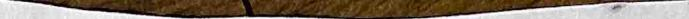
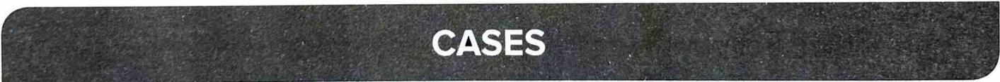

# Chapter Z

# The Balance Sheet

# 2.1 INTRODUCTION

The balance sheet represents assets owned by a company at a particular time and the claims of the owners and the outsiders against those assets at that time. It can be called a statement of wealth since it provides details of assets that the company owns and outstanding loans and other claims against the company. The difference between the two is the shareholders' wealth. We often prepare a statement of wealth in our personal ife, particularly when we borrow money from banks or other financial institutions. The lending institutions ask us to provide the details of assets like house, agriculture land, car and other vehicles, gold, deposits, shares and bonds, etc. and also outstanding loans and other commitments standing against such asets. The difference between these two values gives an indication of our wealth and lenders use this information while deciding a loan proposal. The wealth of the shareholders can be computed with the help of the following balance sheet equation:

Asset - Liabilities $\circeq$ Shareholders' Equity or Wealth.

The balance sheet provides the following information to the users of financial statements:

Sie of the companyThe total alue ofthe assts givessome ida about the size ofthe copay Since the details of balance sheet items are provided for two years, it is possible to see the overall growth of the business over the preceding period.A comparison with other firms in the industry shows the relative size of the company in an industry.

composition is useful to assess whether the firm is eficiently managing the assets.

Liabilitiestoutsiers Assetscan be acquired by borrwing fund or withn funds.The balance shtprovides the etails ofhow much the company must pay tooutsiders.Th liaility tooutsiers cn be in theforofanunpaidoanor upaiduppliersduesor other epenses is also possible to see thegrwthof liabilitis tooutsidersbycomparing the liabilitieser years. Further, theextent to which the companyuses outsiders'funds increating assets can be seen by comparing liabilities and assets.

Equity or shareholders' fund The owners' stake on the assets can be assessed by comparing the total assets and shareholders' fund. If the shareholders' fund is small compared to outsiders' liability, it means the copany is heavily relying on outsiders' iability. This may affect the solveny of the company in the future, particularly when the business slows down temporarily. The company is still under obligation to pay interest and other liabilities and they are difficult to be deferred.

# 2.2 BALANCE SHEET FORMAT

The balance sheet shows the different classif cations of assets and liabilities arranged in a particular order, depending on the conventions or rules prevailing in different countries. The two most used forms of presenting the balance sheet are vertical form and horizontal form. In the yertical form of classifcation, the assets, liabilities, and shareholders' funds are shown one below the other, however, the sequence differs across the countries. Indian companies which follow the vertical form of classifying balance sheet items ist assets first, then equity (shareholders' fund) and finally liabilities. Ina horizontal format, the assets are shown on one side and owners' equity and liabilities are shown on the other side.

Schedule II of the Companies Act, 2013, lays down the format of the balance sheet for companies registered under the Act. The new revised Schedule II prescribes the vertical form of balance sheet and is applicable for all fnancial statements for periods on or after 1 April 2014. Asian Paints (India) Ltd(APL) has presented its balance sheet as per the revised Schedule Ⅲ of the Companies Act, 2013, as shown in Exhibit 2.1. Assets and liabilities are arranged in descending order of permanence – the most permanent or long-term item is placed at the top. Indian companies used to present equity and liabilities first before assets while the common practice in other countries is to show assets first and then liabilities and equity. The logic for the Indian format can be attributed to the sequence of operations that a business unit typically performs– first it acquires equity, then it raises loans and uses the available funds to first buy fixed assets and then finally current assets. The logic of other formats is to first find the assets owned by the company, then identify liabilities against the assets and finally to show the difference as owners' wealth. Indian companies since 2017 have changed the format and aligned themselves with the international format where assets are shown first and then equity and liabilities. Though the format is changed,

raising nancial reoures frst and then invest in the assts ofthe busiess.

# Bxhibit 2.

Balance sheet as of 31 March 2020 of Asian Paints (India) Ltd

( in crore)   

<table><tr><td rowspan=5 colspan=5>Assets                                                                       (K in crore)NotesAs atAs at31.03.2020 31.03.2019Non-current assetsProperty, plant and equipment                                        2A         4,148.60      4,430.62</td></tr><tr><td rowspan=1 colspan=1>Notes</td><td rowspan=1 colspan=1>As at31.03.2020</td><td rowspan=1 colspan=1>As at31.03.2019</td></tr><tr><td rowspan=1 colspan=1></td><td rowspan=1 colspan=1></td><td rowspan=1 colspan=1></td></tr><tr><td rowspan=2 colspan=1>2A</td><td rowspan=2 colspan=1>4,148.60</td><td rowspan=2 colspan=1>4,430.62</td></tr><tr><td rowspan=3 colspan=2>Right of use assetCapital workin-progress</td><td rowspan=2 colspan=3>Right of use asset</td></tr><tr><td rowspan=1 colspan=1>2B</td><td rowspan=1 colspan=1>726.23</td><td rowspan=1 colspan=1>700.61</td></tr><tr><td rowspan=2 colspan=1></td><td rowspan=2 colspan=1>108.09</td><td rowspan=2 colspan=1>179.31</td></tr><tr><td rowspan=2 colspan=2>Goodwill</td></tr><tr><td rowspan=2 colspan=1>3A</td><td rowspan=2 colspan=1>35.36</td><td rowspan=2 colspan=1>35.36</td></tr><tr><td rowspan=3 colspan=2>Other intangible assetsInvestments in subsidiaries and associates</td></tr><tr><td rowspan=1 colspan=1>3B</td><td rowspan=1 colspan=1>50.27</td><td rowspan=1 colspan=1>54.61</td></tr><tr><td rowspan=2 colspan=1></td><td rowspan=2 colspan=1>1,176.99</td><td rowspan=2 colspan=1>830.35</td></tr><tr><td rowspan=2 colspan=2>Financial assets</td></tr><tr><td rowspan=2 colspan=1></td><td rowspan=2 colspan=1></td><td rowspan=2 colspan=1></td></tr><tr><td rowspan=2 colspan=2>Investments</td></tr><tr><td rowspan=2 colspan=1>4</td><td rowspan=2 colspan=1>1,048.59</td><td rowspan=1 colspan=1>987.02</td></tr><tr><td rowspan=2 colspan=2>Loans</td><td></td></tr><tr><td rowspan=1 colspan=1>5</td><td rowspan=1 colspan=1>64.1</td><td rowspan=1 colspan=1>76.00</td></tr><tr><td rowspan=2 colspan=2>Other financial assets</td><td></td><td></td><td></td></tr><tr><td rowspan=1 colspan=1>6</td><td rowspan=1 colspan=1>232.47</td><td rowspan=1 colspan=1>220.70</td></tr><tr><td rowspan=2 colspan=2>Current tax assets (net)</td><td></td><td></td><td></td></tr><tr><td rowspan=1 colspan=1>7</td><td rowspan=1 colspan=1>137.94</td><td rowspan=1 colspan=1>81.48</td></tr><tr><td rowspan=2 colspan=2>Other non-current assets</td><td></td><td></td><td></td></tr><tr><td rowspan=1 colspan=1>8</td><td rowspan=1 colspan=1>32.87</td><td rowspan=1 colspan=1>33.48</td></tr><tr><td rowspan=1 colspan=2></td><td rowspan=1 colspan=1></td><td rowspan=1 colspan=1>7,761.92</td><td rowspan=1 colspan=1>7,629.54</td></tr><tr><td rowspan=1 colspan=2>Current assets</td><td rowspan=1 colspan=1></td><td rowspan=1 colspan=1></td><td rowspan=1 colspan=1></td></tr><tr><td rowspan=1 colspan=2>Inventories</td><td rowspan=1 colspan=1>9</td><td rowspan=1 colspan=1>2,827.47</td><td rowspan=1 colspan=1>2,585.10</td></tr><tr><td rowspan=1 colspan=2>Financial assets</td><td rowspan=1 colspan=1></td><td rowspan=1 colspan=1></td><td rowspan=1 colspan=1></td></tr><tr><td rowspan=1 colspan=2>Investments</td><td rowspan=1 colspan=1>4</td><td rowspan=1 colspan=1>432.35</td><td rowspan=1 colspan=1>1,146.63</td></tr><tr><td rowspan=1 colspan=2>Trade receivables</td><td rowspan=1 colspan=1>10</td><td rowspan=1 colspan=1>1,109.22</td><td rowspan=1 colspan=1>1,244.95</td></tr><tr><td rowspan=1 colspan=2>Cash and cash equivalents</td><td rowspan=1 colspan=1>11A</td><td rowspan=1 colspan=1>336.96</td><td rowspan=1 colspan=1>98.33</td></tr><tr><td rowspan=1 colspan=2>Other balances with banks</td><td rowspan=1 colspan=1>11B</td><td rowspan=1 colspan=1>39.10</td><td rowspan=1 colspan=1>69.19</td></tr><tr><td rowspan=1 colspan=2>Loans</td><td rowspan=1 colspan=1>5</td><td rowspan=1 colspan=1>21.31</td><td rowspan=1 colspan=1>13.98</td></tr><tr><td rowspan=1 colspan=2>Other financial assets</td><td rowspan=1 colspan=1>6</td><td rowspan=1 colspan=1>846.96</td><td rowspan=1 colspan=1>567.63</td></tr><tr><td rowspan=1 colspan=2>Assets classified as held for sale</td><td rowspan=1 colspan=1></td><td rowspan=1 colspan=1></td><td rowspan=1 colspan=1></td></tr><tr><td rowspan=1 colspan=2>Other current assets</td><td rowspan=1 colspan=1>8</td><td rowspan=1 colspan=1>212.33</td><td rowspan=1 colspan=1>327.54</td></tr></table>

(continued)

Exhibit 2.1 (Continued)

# Balance sheet as of 31 March 2020 of Asian Paints (India) Ltd

<table><tr><td rowspan=2 colspan=8>( in crore</td></tr><tr><td rowspan=2 colspan=2>Assets</td></tr><tr><td rowspan=1 colspan=2>Notes</td><td rowspan=1 colspan=3>As at31.03.2020</td><td rowspan=2 colspan=1>As at31.03.20196,053.35</td></tr><tr><td rowspan=1 colspan=2></td><td rowspan=1 colspan=2></td><td rowspan=1 colspan=3>5,825.70</td></tr><tr><td rowspan=1 colspan=2>Total assets</td><td rowspan=1 colspan=2></td><td rowspan=1 colspan=3>13,587.62</td><td rowspan=2 colspan=1>13,682.89</td></tr><tr><td rowspan=1 colspan=2>Equity and liabilities</td><td rowspan=1 colspan=2></td><td rowspan=1 colspan=3></td></tr><tr><td rowspan=1 colspan=2>Equity</td><td rowspan=1 colspan=2></td><td rowspan=1 colspan=3></td><td rowspan=1 colspan=1></td></tr><tr><td rowspan=1 colspan=1>Equity share capital</td><td></td><td rowspan=1 colspan=2>12</td><td rowspan=1 colspan=3>95.92</td><td rowspan=1 colspan=1>95.92</td></tr><tr><td rowspan=1 colspan=1>Other equity</td><td></td><td rowspan=1 colspan=2>13</td><td rowspan=1 colspan=3>9,357.37</td><td rowspan=1 colspan=1>8,747.04</td></tr><tr><td rowspan=1 colspan=1></td><td></td><td rowspan=1 colspan=2></td><td rowspan=1 colspan=3>9,453.29</td><td rowspan=1 colspan=1>8,842.96</td></tr><tr><td rowspan=1 colspan=1>Liabilities</td><td></td><td rowspan=1 colspan=2></td><td rowspan=1 colspan=3></td><td rowspan=1 colspan=1></td></tr><tr><td rowspan=1 colspan=1>Non-current liabilities</td><td></td><td rowspan=1 colspan=2></td><td rowspan=1 colspan=3></td><td rowspan=1 colspan=2></td></tr><tr><td rowspan=1 colspan=1>Financial Liabilities</td><td></td><td rowspan=1 colspan=2></td><td rowspan=1 colspan=3></td><td rowspan=1 colspan=2></td></tr><tr><td rowspan=1 colspan=1>Borrowings</td><td></td><td rowspan=1 colspan=2>14</td><td rowspan=1 colspan=3>18.50</td><td rowspan=1 colspan=2>10.89</td></tr><tr><td rowspan=1 colspan=1>Lease liabilities</td><td></td><td rowspan=1 colspan=2>15</td><td rowspan=1 colspan=3>496.22</td><td rowspan=1 colspan=2>473.86</td></tr><tr><td rowspan=1 colspan=1>Other financial liabilities</td><td></td><td rowspan=1 colspan=2>16</td><td rowspan=1 colspan=3>0.46</td><td rowspan=1 colspan=2>1.38</td></tr><tr><td rowspan=1 colspan=1>Provisions</td><td rowspan=1 colspan=2>17</td><td rowspan=1 colspan=3>136.78</td><td rowspan=1 colspan=2>118.48</td></tr><tr><td rowspan=1 colspan=1>Deferred tax liabilities (Net)</td><td rowspan=1 colspan=2>18C</td><td rowspan=1 colspan=3>282.68</td><td rowspan=1 colspan=2>392.39</td></tr><tr><td rowspan=1 colspan=1>Other non-current liabilities</td><td rowspan=1 colspan=2>19</td><td rowspan=1 colspan=3>4.64</td><td rowspan=1 colspan=2>1.52</td></tr><tr><td rowspan=1 colspan=1>Current liabilities</td><td rowspan=1 colspan=2></td><td rowspan=1 colspan=2></td><td></td><td rowspan=1 colspan=2></td></tr><tr><td rowspan=1 colspan=1>Financial libilities</td><td rowspan=1 colspan=2></td><td rowspan=1 colspan=2></td><td></td><td rowspan=1 colspan=2></td></tr><tr><td rowspan=1 colspan=1>Borrowings</td><td rowspan=1 colspan=2>14</td><td rowspan=1 colspan=2></td><td></td><td rowspan=1 colspan=2>4.35</td></tr><tr><td rowspan=1 colspan=1>Lease liabilities</td><td rowspan=1 colspan=2>15</td><td rowspan=1 colspan=2>142.43</td><td></td><td rowspan=1 colspan=2>125.22</td></tr><tr><td rowspan=1 colspan=1>Trade payables</td><td rowspan=1 colspan=2></td><td rowspan=1 colspan=2></td><td></td><td rowspan=1 colspan=2></td></tr><tr><td rowspan=1 colspan=1>Dues to micro enterprises</td><td rowspan=1 colspan=2>20</td><td rowspan=1 colspan=2>45.86</td><td></td><td rowspan=1 colspan=2>42.22</td></tr><tr><td rowspan=1 colspan=1>Dues to others</td><td rowspan=1 colspan=2>20</td><td rowspan=1 colspan=2>1,714.22</td><td></td><td rowspan=1 colspan=2>2,020.07</td></tr><tr><td rowspan=1 colspan=1>Other financial liabilities</td><td rowspan=1 colspan=2>16</td><td rowspan=1 colspan=2>1,118.89</td><td rowspan=1 colspan=3>1,429.38</td></tr><tr><td rowspan=1 colspan=1>Other current liabilities</td><td rowspan=1 colspan=2>19</td><td rowspan=1 colspan=2>80.92</td><td rowspan=1 colspan=3>119.23</td></tr><tr><td rowspan=1 colspan=1>Provisions</td><td rowspan=1 colspan=2>17</td><td rowspan=1 colspan=2>44.14</td><td rowspan=1 colspan=3>52.27</td></tr><tr><td rowspan=1 colspan=1>Current tax liabilities (Net)</td><td rowspan=1 colspan=2>21</td><td rowspan=1 colspan=2>48.59</td><td rowspan=1 colspan=3>48.67</td></tr><tr><td rowspan=1 colspan=1></td><td rowspan=1 colspan=2></td><td rowspan=1 colspan=2>3,195.05</td><td rowspan=1 colspan=3>3,841.41</td></tr><tr><td rowspan=1 colspan=1>Total equity and liabilities</td><td rowspan=1 colspan=2></td><td rowspan=1 colspan=2>13,587.62</td><td rowspan=1 colspan=3>13,682.89</td></tr></table>

# 2.3 CONSOLIDATION

$\mathbf { \nabla } ^ { \epsilon } \mathbf { A } ^ { \prime }$ $5 0 \%$   
CompanyB'is a subsidiary of CompanyA' and CompanyA is called the holding company. Te  tii theholigoa in itsnanial statements o theextent ofits interest insubsidiaryoaie before itpresents them separately as consolidated balance sheet, consolidated proandloss .

The objectve of such consolidation as per Accounting Standard21 is that"consolidated financial statements are presented by a parent (also known as holding enterprise) to provide fnancialifat cctivif p.eesteni resent ciifatipaennissinei to show the economic resoures controlled by thegroup, the obligations of he group and results the group achieves with its resources". Consolidation is required even whena company is not subsiday copny but the prent copany contols the compositionfthear ofiecorsi thecasea c thecoositionof thecoesnding geing  incaeofa h enterprise toobtain economic benefits from its activities. Exhibit 2.2 presents the Consolidated Balance Sheet of Asian Paints (India) Ltd.

Exhibit 2.2 Consolidated balance sheet as of 31 March 2020 of Asian Paints (India) Ltd   
(in crore)   

<table><tr><td rowspan=1 colspan=1>Assets</td><td rowspan=1 colspan=1>Notes</td><td rowspan=1 colspan=1>As at31.03.2020</td><td rowspan=1 colspan=1>As at31.03.2019</td></tr><tr><td rowspan=1 colspan=1>Non-current assets</td><td rowspan=1 colspan=1></td><td rowspan=1 colspan=1></td><td rowspan=1 colspan=1></td></tr><tr><td rowspan=1 colspan=1>Property, plant and equipment</td><td rowspan=1 colspan=1>2A</td><td rowspan=1 colspan=1>4,764.76</td><td rowspan=1 colspan=1>5,030.44</td></tr><tr><td rowspan=1 colspan=1>Right of use asset</td><td rowspan=1 colspan=1>2B</td><td rowspan=1 colspan=1>920.09</td><td rowspan=1 colspan=1>871.12</td></tr><tr><td rowspan=1 colspan=1>Capital work-in-progress</td><td rowspan=1 colspan=1></td><td rowspan=1 colspan=1>140.24</td><td rowspan=1 colspan=1>209.67</td></tr><tr><td rowspan=1 colspan=1>Goodwill</td><td rowspan=1 colspan=1>3A</td><td rowspan=1 colspan=1>319.99</td><td rowspan=1 colspan=1>321.30</td></tr><tr><td rowspan=1 colspan=1>Other intangible assets</td><td rowspan=1 colspan=1>3B</td><td rowspan=1 colspan=1>267.47</td><td rowspan=1 colspan=1>273.70</td></tr><tr><td rowspan=1 colspan=1>Investments in subsidiaries and associates</td><td rowspan=1 colspan=1>4</td><td rowspan=1 colspan=1>456.63</td><td rowspan=1 colspan=1>405.83</td></tr><tr><td rowspan=1 colspan=1>Financial assets</td><td rowspan=1 colspan=1></td><td rowspan=1 colspan=1></td><td rowspan=1 colspan=1></td></tr><tr><td rowspan=1 colspan=1>Investments</td><td rowspan=1 colspan=1>4</td><td rowspan=1 colspan=1>1,049.74</td><td rowspan=1 colspan=1>988.22</td></tr><tr><td rowspan=1 colspan=1>Loans</td><td rowspan=1 colspan=1>5</td><td rowspan=1 colspan=1>68.24</td><td rowspan=1 colspan=1>78.60</td></tr><tr><td rowspan=1 colspan=1>Trade receivables</td><td rowspan=1 colspan=1>6</td><td rowspan=1 colspan=1>4.21</td><td rowspan=1 colspan=1>6.09</td></tr><tr><td rowspan=1 colspan=1>Other financial assets</td><td rowspan=1 colspan=1>7</td><td rowspan=1 colspan=1>248.31</td><td rowspan=1 colspan=1>226.79</td></tr></table>

(continued)

# Exhibit 2.1 (Continued)

# Consolidated balance sheet as of 31 March 2020 of Asian Paints (India) Ltd

(in crore)

<table><tr><td rowspan=1 colspan=2>Assets</td><td rowspan=1 colspan=2>Notes</td><td rowspan=1 colspan=2>As at31.03.2020</td><td rowspan=1 colspan=1>As at31.03.2019</td></tr><tr><td rowspan=1 colspan=2>Deferred tax assets (net)</td><td rowspan=1 colspan=2>21</td><td rowspan=1 colspan=2>16.80</td><td rowspan=1 colspan=1>29.26</td></tr><tr><td rowspan=1 colspan=2>Current tax assets (net)</td><td rowspan=1 colspan=2>9</td><td rowspan=1 colspan=2>253.09</td><td rowspan=1 colspan=1>158.87</td></tr><tr><td rowspan=1 colspan=2>Other-non-current assets</td><td rowspan=1 colspan=2>10</td><td rowspan=1 colspan=2>65.09</td><td rowspan=1 colspan=1>51.26</td></tr><tr><td rowspan=1 colspan=1></td><td></td><td rowspan=1 colspan=2></td><td rowspan=1 colspan=2>8,574.66</td><td rowspan=1 colspan=1>8,651.15</td></tr><tr><td rowspan=1 colspan=1>Current assets</td><td></td><td rowspan=1 colspan=2></td><td rowspan=1 colspan=2></td><td rowspan=1 colspan=1></td></tr><tr><td rowspan=1 colspan=1>Inventories</td><td></td><td rowspan=1 colspan=2>11</td><td rowspan=1 colspan=2>3,389.81</td><td rowspan=1 colspan=1>3,149.86</td></tr><tr><td rowspan=1 colspan=1>Financial assets</td><td></td><td rowspan=1 colspan=2></td><td rowspan=1 colspan=2></td><td rowspan=1 colspan=1></td></tr><tr><td rowspan=1 colspan=1>Investments</td><td></td><td rowspan=1 colspan=2>4</td><td rowspan=1 colspan=2>512.48</td><td rowspan=1 colspan=1>1,174.53</td></tr><tr><td rowspan=2 colspan=1>Trade receivables</td><td></td><td></td><td></td><td></td><td></td><td></td></tr><tr><td></td><td rowspan=1 colspan=2>6</td><td rowspan=1 colspan=2>1,795.22</td><td rowspan=1 colspan=1>1,907.33</td></tr><tr><td rowspan=2 colspan=1>Cash and cash equivalents</td><td></td><td></td><td></td><td></td><td></td><td></td></tr><tr><td></td><td rowspan=1 colspan=2>8A</td><td rowspan=1 colspan=2>563.83</td><td rowspan=1 colspan=1>275.97</td></tr><tr><td rowspan=2 colspan=1>Other balances with banks</td><td></td><td></td><td></td><td></td><td></td><td></td></tr><tr><td></td><td rowspan=1 colspan=2>8B</td><td rowspan=1 colspan=2>219.00</td><td></td><td rowspan=1 colspan=1>168.91</td></tr><tr><td rowspan=1 colspan=1>Loans</td><td></td><td rowspan=1 colspan=2>5</td><td rowspan=1 colspan=2>18.67</td><td rowspan=1 colspan=2>15.59</td></tr><tr><td rowspan=1 colspan=1>Other financial assets</td><td></td><td rowspan=1 colspan=2>7</td><td rowspan=1 colspan=2>781.65</td><td rowspan=1 colspan=2>525.97</td></tr><tr><td rowspan=1 colspan=1>Assets classified as held for sale</td><td rowspan=1 colspan=2>12</td><td rowspan=1 colspan=2>13.86</td><td rowspan=1 colspan=2>14.93</td></tr><tr><td rowspan=1 colspan=1>Other current assets</td><td rowspan=1 colspan=2>10</td><td rowspan=1 colspan=2>285.59</td><td rowspan=1 colspan=2>393.86</td></tr><tr><td rowspan=1 colspan=1></td><td rowspan=1 colspan=2></td><td rowspan=1 colspan=2>7,580.11</td><td rowspan=1 colspan=2>7,626.95</td></tr><tr><td rowspan=1 colspan=1>Total assets</td><td rowspan=1 colspan=2></td><td rowspan=1 colspan=2>16,154.77</td><td rowspan=1 colspan=2>16,278.10</td></tr><tr><td rowspan=1 colspan=1>Equity and liabilities</td><td rowspan=1 colspan=2></td><td rowspan=1 colspan=2></td><td rowspan=1 colspan=2></td></tr><tr><td rowspan=2 colspan=1>Equity</td><td></td><td></td><td></td><td></td><td></td><td></td></tr><tr><td rowspan=1 colspan=2></td><td rowspan=1 colspan=2></td><td rowspan=1 colspan=2></td></tr><tr><td rowspan=2 colspan=1>Equity share capital</td><td></td><td></td><td></td><td></td><td></td><td></td></tr><tr><td rowspan=1 colspan=2>13</td><td rowspan=1 colspan=2>95.92</td><td rowspan=1 colspan=2>95.92</td></tr><tr><td rowspan=2 colspan=1>Other equity</td><td></td><td></td><td></td><td></td><td></td><td></td></tr><tr><td rowspan=1 colspan=2>14</td><td rowspan=1 colspan=2>10,034.24</td><td rowspan=1 colspan=2>9,374.63</td></tr><tr><td rowspan=2 colspan=1>Equity attributable to the owners of the company.</td><td></td><td></td><td></td><td></td><td></td><td></td></tr><tr><td rowspan=1 colspan=2></td><td rowspan=1 colspan=2>10,130.16</td><td rowspan=1 colspan=2>9,470.55</td></tr><tr><td rowspan=1 colspan=1>Non-controlling interests</td><td rowspan=1 colspan=2>14</td><td rowspan=1 colspan=2>403.53</td><td rowspan=1 colspan=2>361.25</td></tr><tr><td rowspan=1 colspan=1></td><td rowspan=1 colspan=2></td><td rowspan=1 colspan=2>10,533.69</td><td rowspan=1 colspan=2>9831.80</td></tr><tr><td></td><td></td><td></td><td></td><td></td><td></td><td></td></tr><tr><td></td><td rowspan=1 colspan=2></td><td rowspan=1 colspan=2></td><td rowspan=1 colspan=2></td></tr><tr><td rowspan=2 colspan=1>Liabilities</td><td></td><td></td><td></td><td></td><td></td><td></td></tr><tr><td rowspan=1 colspan=2></td><td rowspan=1 colspan=2></td><td rowspan=1 colspan=2></td></tr><tr><td rowspan=2 colspan=1>Non-current liabilities</td><td></td><td></td><td></td><td></td><td></td><td></td></tr><tr><td rowspan=1 colspan=2></td><td rowspan=1 colspan=2></td><td rowspan=1 colspan=2></td></tr><tr><td rowspan=2 colspan=1>Financial liabilities</td><td></td><td></td><td></td><td></td><td></td><td></td></tr><tr><td rowspan=1 colspan=2></td><td rowspan=1 colspan=2></td><td rowspan=1 colspan=2></td></tr><tr><td></td><td rowspan=1 colspan=2></td><td rowspan=1 colspan=2></td><td rowspan=1 colspan=2></td></tr></table>

# Consolidated balance sheet as of 31 March 2020 of Asian Paints (India) Ltd

incrore)

<table><tr><td rowspan=11 colspan=1>AssetsBorrowingsLease liabilitiesOther financial liabilitiesProvisionsDeferred tax liabilities (net)Other non-current liabilitiesCurrent liabilities</td><td rowspan=1 colspan=1></td><td rowspan=1 colspan=2></td></tr><tr><td rowspan=1 colspan=1>Notes</td><td rowspan=1 colspan=1>As at31.03.2020</td><td rowspan=1 colspan=1>As at31.03.2019</td></tr><tr><td rowspan=1 colspan=1>15</td><td rowspan=1 colspan=1>18.63</td><td rowspan=1 colspan=1>19.06</td></tr><tr><td rowspan=1 colspan=1>16</td><td rowspan=1 colspan=1>589.94</td><td rowspan=1 colspan=1>541.64</td></tr><tr><td rowspan=1 colspan=1>17</td><td rowspan=1 colspan=1>2.94</td><td rowspan=1 colspan=1>3.65</td></tr><tr><td rowspan=1 colspan=1>18</td><td rowspan=1 colspan=1>180.75</td><td rowspan=1 colspan=1>155.59</td></tr><tr><td rowspan=1 colspan=1>21</td><td rowspan=1 colspan=1>443.80</td><td rowspan=1 colspan=1>543.27</td></tr><tr><td rowspan=1 colspan=1>19</td><td rowspan=1 colspan=1>4.64</td><td rowspan=1 colspan=1>2.99</td></tr><tr><td rowspan=2 colspan=1></td><td rowspan=2 colspan=1>1,240.70</td><td rowspan=1 colspan=1>1,266.20</td></tr><tr><td rowspan=3 colspan=1>Current liabilitiesFinancial liabilities</td><td></td></tr><tr><td rowspan=1 colspan=1></td><td rowspan=1 colspan=1></td><td rowspan=1 colspan=1></td></tr><tr><td rowspan=2 colspan=1></td><td rowspan=2 colspan=1></td><td rowspan=2 colspan=1></td></tr><tr><td rowspan=2 colspan=1>Borrowings</td></tr><tr><td rowspan=2 colspan=1>15</td><td rowspan=2 colspan=1>321.48</td><td rowspan=2 colspan=1>596.53</td></tr><tr><td rowspan=2 colspan=1>Lease liabilities</td></tr><tr><td rowspan=2 colspan=1>16</td><td rowspan=2 colspan=1>173.87</td><td rowspan=2 colspan=1>151.38</td></tr><tr><td rowspan=2 colspan=1>Trade payables</td></tr><tr><td rowspan=2 colspan=1></td><td rowspan=2 colspan=1></td><td rowspan=2 colspan=1></td></tr><tr><td rowspan=2 colspan=1>Dues to micro enterprises</td></tr><tr><td rowspan=2 colspan=1>20</td><td rowspan=2 colspan=1>60.72</td><td rowspan=2 colspan=1>61.37</td></tr><tr><td rowspan=2 colspan=1>Dues to others</td></tr><tr><td rowspan=1 colspan=1>20</td><td rowspan=1 colspan=1>2,075.85</td><td rowspan=1 colspan=1>2,332.92</td></tr><tr><td rowspan=2 colspan=1>Other financial liabilities</td><td></td><td></td><td></td></tr><tr><td rowspan=1 colspan=1>17</td><td rowspan=1 colspan=1>1,374.34</td><td rowspan=1 colspan=1>1,651.34</td></tr><tr><td rowspan=2 colspan=1>Other current liabilities</td><td></td><td></td><td></td></tr><tr><td rowspan=1 colspan=1>19</td><td rowspan=1 colspan=1>131.61</td><td rowspan=1 colspan=1>163.87</td></tr><tr><td rowspan=2 colspan=1>Provisions</td><td></td><td></td><td></td></tr><tr><td rowspan=1 colspan=1>18</td><td rowspan=1 colspan=1>62.46</td><td rowspan=1 colspan=1>76.21</td></tr><tr><td rowspan=2 colspan=1>Current tax liabilities (net)</td><td></td><td></td><td></td></tr><tr><td rowspan=1 colspan=1>22</td><td rowspan=1 colspan=1>180.05</td><td rowspan=1 colspan=1>146.48</td></tr><tr><td rowspan=2 colspan=1></td><td></td><td></td><td></td></tr><tr><td rowspan=1 colspan=1></td><td rowspan=1 colspan=1>4,380.38</td><td rowspan=1 colspan=1>5,180.10</td></tr><tr><td rowspan=1 colspan=1>Total equity and liabilities</td><td rowspan=1 colspan=1></td><td rowspan=1 colspan=1>16,154.77</td><td rowspan=1 colspan=1>16,278.10</td></tr></table>

# 2.4 BALANCE SHEET DATE

As stated earlier and can be seen in the title of the Balance Sheet, it is a statement prepared at a point in time. Thus, the title of the Balance Sheet always mentions the date of preparation, for example, 'as on 31 March 2020. The Balance Sheet of Asian Paints (India) Ltd as of March 31, 2020, refers to assets, liabilities and shareholders' fund position of the company on that particular date and more precisely at the normal closing business hours of the company. Normally, the balance sheet is finalized and published sometime between June and September of the year It means that the assets, liabilities and owners' equity of the company on the day when the balance sheet is received by the investors can be signifcantly dfferent from what is mentioned in the balance sheet due to lapse of time and ongoing business.

# 2.8 Financial Stements andAnalsis

T $\textsf { a }$ next working day and demonstrate accounting and fnancial discipline.

# 2.5 FUNDS EMPLOYED

Capita iscritical for starting adunningbusinesunits.Suchcapital is raised brody from three sources. Shareholders bring equity capital at the beginning of the business venture and further equity capital when major investments are made.As the frm starts earing proft, the shareholders allow the management to retain part of the profit and such'retained capital' forms the second major source of capital. This'retained capital' is also a form of equity given by shareholders and can be called 'internal equity. The retained profit along with few other items is called'other equity' in the current format of the balance sheet. The third and most important source of capital is borrowing from financial institutions or banks and market. This is called borrowed capital or loan funds. Financial engineering has helped to develop several new ways to raise capital, which are mostly hybrid or a variation of the above-mentioned forms of capital. For example, leasing is another source of borrowed capital and preference share capital is a kind of equity capital. This part of the balance sheet shows the extent of funds that the business unit has obtained from equity and loan funds and is hence called 'equity and liabilities'

Sources of funds are also arranged in the order of permanence, with the most permanent being shown at the top. The balance sheet normally has four columns. The first column describes the details of the balance sheet item. Each item of the balance sheet is normally represented as consolidated fi gures of several sub-items. Schedules or notes forming part of the balance shets provide the details. The second column gives the schedule or note number. The third and fourth columns give balance sheet values of the current year and previous year respectively. Several companies also provide three years of data by adding the fifth column.

# 2.6 EQUITY OR SHAREHOLDERS'FUNDS

Equity or the shareholders' funds represent the funds or capital provided by the shareholders of the business. Shareholders provide funds in two forms. They can bring fresh capital as and when required or allow the company to retain a part of the profit. The former is called external equity and the later is called internal equity. There is no real distinction between contributed capital and retained capital as far as the shareholders are concerned as they would expect the company to use the entire amount for their benefit.Although accounting statements provide the details of contributed capital and retained capital separately, this distinction is rarely used while analyzing financial statements. The shareholders of Asian Paints (India) Ltd have contributed 95.92 crore

# 2.7 EQUITY SHARE CAPITAL

At thee ngtepaor registerigtecoande eCoies A that contains arious details of the companylike thenamef the comany, registered of e anasi sharholer itis calld rights fing.

Sharecapital can be in two forms, namely,equity sharecapital andpreference sharecapital Equity hare capital or common stock represents wnership of the company.Theseare permanent capitalarhigriskhereis un heaulperfell ewardel igis hat heaiofisi The conceptof imited ibilityenables the formation ofarge copanieswith hehelp of severl milions of mall shareholders and hence, contributes to the industrial development of nations.

Preference shares carry a certain fixed rate of dividend, which must be paid by the company to the preference shareholders before any dividend is paid to the equity shareholders, provided the company makes profits. In case the company does not make enough profits, it would not pay the preference dividend. However, in such a case, the unpaid dividend is normally paid in the subsequent years (in the case of cumulative preference shares) before any dividend is paid to the equity shareholders. In the event of liquidation of the company, after meeting all external liabilities, preference shareholders' dues are first met before sharing the residual funds with equity shareholders provided if the business has surplus funds. The liability of the preference shareholders is also limited. In that sense, preference shareholders are slightly better off than equity shareholders however, they also carry a certain amount of risk. Here, the term preference relates to preference over equity shareholders. Preference share capital is normally redeemed after some point in time. Though Asian Paints India) Ltd is authorized to issue preference share capital, there is no outstanding value on preference share capital. InNote 12 of the nancial statements, Asian Paints provides the details of equity share capital (Exhibit 2.3)

Authorized This is the maximum amount of share capital that a company can issue. A company can increase its authorized capital by amending the Memorandum of Association by follwing the procedure aid down under the Companies Act, 2013. The number of shares issued is given in the first column ada descriptionof the share isstated in the second column.Equity shares of Re. 1 each' means the face value of each equity share is Re. 1, Similarly, the face value of preference shar is10.Facevaluecanbenyhigbut norally tisR.or10.AfewI

# 2.10inancial StatementsndAalsis

coaniesa f.ThAthriharapiofAiaPi s ta

Exhibit 2.3 Share capital

( in crore)   

<table><tr><td colspan="2">Schedule 2: Share capital</td><td>As on 31.03.2020</td><td>As on 31.03.2019</td></tr><tr><td colspan="2">Authorized</td><td>99.50</td><td>99.50</td></tr><tr><td>99,50,00,000 50,000</td><td>(Previous year 99,50,00,000) equity shares of Re.1 each</td><td></td><td></td></tr><tr><td rowspan="3">Issued and subscribed</td><td rowspan="3">(Previous year 50,000)11% redeemable cumulative preference shares of 100 each</td><td>0.50</td><td>0.50</td></tr><tr><td>100.00</td><td>100.00</td></tr><tr><td>95.92 95.92</td><td>95.92 95.92</td></tr></table>

Issued and Subseribed This is the amount of share capital that has been issued by the company to the shareholders. The first column shows the number of shares issued. The value of issued capital is equal to the number of shares issued multiplied by the nominal or face yalue of each share. Subscribed capital is the amount of share capital that has been bought by the shareholders. It is equal to the number of shares subscribed times the nominal yalue of each share. Asian Paints (India) Ltd has issued 95,91,97,790 shares and all of them have been subscribed and hence the Issued and Subscribed share capital value is 95.92 crore.

Called In certain cases, the company might have asked shareholders to pay only a part of the face value.In such an event, the called value will be lower than subscribed value. For fullypaid shares, the amount of called share capital hould be equal to the amount of subscrihed share nita

Paidais  i n t

a ss sharthe seteoana hae perfoaiseectbeiaforeabl.

auigsshares isiquiditnsideratio.thearetprif shares iaaaltvest shares becauseofheeforahuginesent.Forexampleite stokpricoffoss 400fopluldeabloby iaoffMay0 MRF stock was quoting at 83382onNational Stock Exchange. The stock hit the highest price of92306on22January 2021.Owing to such a highvalue of the stock, the liquidity of the shares is likely tobe affected in that process.Hence,companiesissue bonus shares andbring down the share prie withina nominal range. The fall in price will not afect the shareholders wealth since they willhave more shares now.For instance,if the pre-bonus share price is 240 and the company ssues 1:1 bonus shares, the price will be around 120. Suppose the price declines to 122 immediately after the bonus issue, and if you have 10 shares of the company before the bonus issue, you will now have 10 additional shares and together 20 shares. The market value of your shares before the bonus issue was <2400 (10 shares × 240) and now it will be <2440 (20 shares × 122). At 122, the shareholder of the company can expect better liquidity compared to liquidityprevailing when the price was240.The bonus can be fixed at any ratio. For example a bonus ratio of 1:2 means 1 bonus share for every 2 shares held by the investors.

Stock split Stock split is like a bonus issue and has same implication. The number of shares increases after the stock split or bonus issue. The difference is a stock split doesn't require capitalization or transferring funds from reserves and surplus to share capital. Stock split reduces the face value. Suppose the current face value is 10. The company decides to have a stock split of 2:1 instead of a bonus issue of 1:1. In a stock split,the number of shares willincrease but the face value will now be reduced to 5. However, companies need to send fresh certificates or pass a fresh entry in the electronic depository under both methods. Further, there is no increase in shareholders' fund or the value of the assets under both methods. While some companies prefer bous shares,others choose stock split.The curent ed is stock plit andAsianPaints Ind) Ltd has alsoopted for the stock split in2011.

During the last three decades, Asian Paints has issued six bonus shares as detailed below. In other words, if you had 500 shares of the company in 1984, you would now have about 9216 shares in2020. Asian Paints has also divided the $\yen 10$ shares into ten Re. 1 shares (called stock split). In other words, 9216 shares of 10 each will now be 92160 shares of Re. 1 each. In 1985, your investment in 500 shares would have costed 10,000 to 15,000 and its current value at 2537 as of March 2021 is 23.38 crore. The initial investment has grown at an average compound rate of $3 1 \%$ per year for the last 36 years. Asian Paints (India) Ltd rewarded the investors by focusing its core business and expanding globally despite competition from multinationals and unorganized sectors, which enjoy considerable tax benefits. The company's achievement is fascinating and that is one of the reasons for selecting Asian Paints for this book to illustrate the financial analysis.

<table><tr><td>Year 1985</td><td>1987</td><td>1992 1995</td><td>2000</td><td>2003</td></tr><tr><td>Bonus ratio 3:5</td><td>1:2</td><td>1:1 3.5</td><td>3:5</td><td>1:2</td></tr></table>

# Shares Issued on Mergers

Asian Paints has issued 294,000 fully paid shares without payment received in cash to the shareholders of Pentasia Chemicals Ltd under a scheme of rehabilitation/amalgamation.1 When a company merges with another company, the shareholders of the company which is merging with the other company will have to get either cash or shares of the other company since shares of the merged company are no longer traded in the market. At the time of the merger, based on the relative valuation of the two companies, the company will announce the swap ratio. Suppose if the swap ratio is 1 share of Asian Paints (India) Ltd for every 25 shares of Pentasia Chemicals Ltd. the shareholders holding 100 shares of Pentasia will get 4 shares of Asian Paints (India) Ltd. Other than bonus shares and stock split, companies might issue shares without getting cash for these reasons. One more example is allotting shares to a collaborator, who provides technology. Here, the company gives shares to get the technology instead of paying cash.

# Cancellation of Shares

Share capital may also be reduced in certain cases. One prominent case is when there is a re-purchase of shares or buyback of shares. Companies are allwed to buy back their shares after following certain procedures, subject to certain conditions. Buyback is normally done when the company has surplus cash and believes that the share prices are traded at a price below their real value. Alternatively, companies may want to have capital restructuring for various reasons. Another instance for cancellation of shares is when shares held in the subsidiary company are merged with those of the parent company. Asian Paints (India) Ltd has not done any share re-purchase so far. Under Indian regulations, shares purchased back must be canceled and this will lead to a reduction in share capital. Many countries including the U.S. allow the company to keep the repurchased

# 2.8 OTHER EQUITY

In thepreviousfomat of the balance sheet, the other equity was called reserves and surplus. This is now renamed as other equity to include reserves and surplus and few other items. The terreservedenotes the amount set aside to meet certainobjectives.Reserves are createdut ofproft.I means out ofproft eaed the company sets aside some part and uses the balanc for distribution in the fomofa dividend to shareholders.Why should the company set asidea part of the proft?Normally, it is govered by the law or agreement, or practice.For example ifa company issues debentures, the debenture holders would like to restrict the company from paying dividends out of proft.Once thedividend is paid it is not possible to ask the shareholders o pay the amount back to meet the liability towards repayment of the debenture amount.It is possible thatebentureholdersput a blanket prohibition for distribution ofproftbut normally shareholders winot like suchrestrictions orictations.Aleatively, debentureholderscanemando set aside some specifed amount, say 20%, of debenture value every year for5 years and shareholders might agree t this arrngeentBothpartiesshareholdersanddebt holers)stand tobenef this arrangemen.Thisconditionleads t thecreation of nwaccount calledDebentureRedemtin Reserve' and the company transfers the agreed amount from the profit and loss account to this account every year for five years and holds the account until debentures are repaid.

Often, non-accounting students and managers tend to believe that the amount set aside for reserve is in the form of cash. This confusion is mainly because normally 'reserve' means something available with us and can be used when required. For example, reserve stock refers to some minimum stock available in the stores which can be used when there is an emergency. It should be noted that the agreement between the shareholders and debenture holders (in this case isthe available proft for payment of dividend wil be determined after seing aside some amount and not by depositing the amount in a bank account. The purpose of such an agreement is to prevent money from going out of the company to shareholders rather than preserving cash for repayment Inother words, the reserve is part ofthe retained prot and it is for managers to decide how to use the retained profit. It can be used for the purchase of fixed assets or current assets or investments or simply repaying some of the existing loans or dues. Note 13 of Asian Paints (India) Ltd gives the details of other equity which includes reserves (Exhibit 2.4).

# Capital Reserve and Revenue Reserve

Reserves and surplus can be broady classifed into twotypes.Reseres createdout of proft or aisigf issue shares at a premium, the face value wil be shown under share capital and the premium pat willbe shnder reeresnd suplus.This surplus is not arisigut ofpro butasreu of raisig capita at a pricegreater thn the face alu.y should companies isue sharest premium? Suppose you are a shareholder of Asian Paints (India) Ltd, whose current market price is2537 (March 2021) and your company is coming out with a public issue. Would you like your company to issue shares at 10 to the public? Existing shareholders will object because the moment another shareholder gets a share at 10, she or he wil be entitled to receive a portion of the future proft of the company. The existing shareholders will feel that such an issue of shares at par is an unfair deal to them and block the company from issuing shares at par. They will be happy if the company issues shares at a premium since they expect new shareholders to pay the 'price' or 'premium' before acquiring the right to partake of the company's fortunes that have not been distributed. The expected premium will also include passing on the right to share future income if the business is doing well. In a few cases like American Depository Receipt (ADR), companies can issue shares at a price more than the current market price.

# Bxhibit 2.4 Other equity

in crore)   

<table><tr><td rowspan=1 colspan=1>Other equity</td><td rowspan=1 colspan=1>As at31.03.2020</td><td rowspan=1 colspan=1>As at31.03.2019</td></tr><tr><td></td><td rowspan=1 colspan=1>44.380.504166.744424.532653.95(9.82)(1740.95)(353.07)2,48168.63</td><td rowspan=1 colspan=1>44.380.504166.743345.902132.17(26.36)(853.68)(173.50)(0.01)110.90</td></tr><tr><td></td><td rowspan=1 colspan=1>9357.37</td><td rowspan=1 colspan=1>8747.04</td></tr></table>

Surplus arising out of revaluation of assets is also capital in nature.Similarly, when a company redeems (returns) preference share capital or buy-back of shares, the share capital value declines. At that time, he company must create a capital redemption reserve account and transfer the amount from profor reserves.Thereason is it ensures hecapital is restored to the previusvale.For example ifa company issuespreferece share capital with an agreement that it will be redeemed

Generalesee eeisaf vale fAianPaintnda of1March20is6.croreSchue whichacufdhre thecompanto rtainschahugemount.Thecopanyhasdistributeearl950crori the last10years asdividendandretained9,195cror.

Retained EarningThe retained eaings represent proft retained afer transfers tovarious reserves nd payment of ividend.At the beginning of 1 April 2019,Asian Paints had a balance of4,424.53crore as retained eanings. During the year, the company added2,653.95 crore i profit andof this,1740.95crore was distributed as dividend. The company also paid 353.07 croreas tax arisingout ofpayent of divide

Other Comprehensive Income2 Suppose Asian Paints bought 100 crore, worth of State Bank of India stock. Let us assume at the end of the year $3 1 ^ { \mathrm { s t } }$ March 2020, the market value of the shares is 140 crore. Since Asian Paints has not sold the shares, the proft is not realized. The question is how we treat the unrealized proft of <40 crore Before the implementation of International Financial Reporting Standards (IFRS), the unrealized profts are not considered while preparing financial statements, but the market value of the investments is reported as additional information. IFRS regulations now require such profits or losses are recognized. The unrealized profts or losses are recognized in two ways. Unrealized profit or loss arising out of certain types of investments (mainly debt instruments) are not reported in the profit and loss account but directly reported as other comprehensive income under other equity. The company can also opt for FVTOCI for certain types of investments and if such option is exercised, any unrealized profit or loss are reported in other equity. Unrealized proft or loss arising out of all other investments are included in the profit and loss account (FVTPL) and then it is brought into other equity. Changes in the value of investments in subsidiary companies are not generally accounted but such investments are carried at cost.

Te disussioeuusiiuisss Thefeereere ofAsianPaints (Idia) is41.rore which is theu of general ee retained earnings, P&L account minus dividends including tax on dividends.

<table><tr><td>Free reserve</td><td>As at 31.03.2020</td><td>As at 31.03.2019</td></tr><tr><td>General reserve Retained earnings</td><td>4166.74 4424.53</td><td>4166.74 3345.90</td></tr><tr><td>Add: Profit for the year Remeasurement of defined benefit plans</td><td>2653.95 (9.82)</td><td>2132.17 (26.36)</td></tr><tr><td>Less: Dividends</td><td>(1740.95)</td><td>(853.68)</td></tr><tr><td>Income tax on dividends</td><td>(353.07)</td><td></td></tr><tr><td>Free reserve</td><td>9141.38</td><td>(173.50)</td></tr></table>

The details provided under other equity are partly technical in nature and hence, one need not worry too much about such details. A large part of other equity is general reserve, retained proft and current year profit and a small part is capital reserve and other comprehensive income (OCI).

# 2.9 DEFERRED TAX LIABILITIES

Deferred tax liabiity (DTL) represents the tax liability that is expected to arise in future and would therefore be payable by the company in future years. This liability is on account of timing differences' between taxable income and accounting income. Readers may wonder how such timing differences arise and how tax authorities allow the firm to defer the payment of tax. DTL is an accounting creation and there is no formal agreement between the firm and tax authorities on the payment of taxes in the future. Business units are required to prepare accounting statements and draw profit and loss account following certain rules and regulation (such as Accounting Standards) and submit them to shareholders. Under income tax rules, business units are legally allowed to recast their proft and loss account by following certain liberal provisions available under the Income Tax Act and pay less tax. Such liberal provisions are of two types. Some provisions permanently allow the taxpayers to enjoy the benefit of lower tax. For example, the profit arising put of certain exports or business units set up in certain backward districts qualifies for such liberal ax provision.On the other hand, certain provisions allw the taxpayers to defer or postpone the

y

Asef

# Exhibit 2.5 Deferred

# Deferred tax computation and its impaet

<table><tr><td rowspan=2 colspan=1>YearUnder company&#x27;s bookProfit before depreciationDepreciationTaxable profit</td><td rowspan=1 colspan=1>1</td><td rowspan=1 colspan=1>2</td><td rowspan=1 colspan=1>3</td><td rowspan=1 colspan=1>4</td><td rowspan=1 colspan=1>5</td><td rowspan=1 colspan=1>6</td></tr><tr><td rowspan=1 colspan=1>500100400</td><td rowspan=1 colspan=1>500100400</td><td rowspan=1 colspan=1>500100400</td><td rowspan=1 colspan=1>500100400</td><td rowspan=1 colspan=1>500100400</td><td rowspan=1 colspan=1>a500100400</td></tr><tr><td rowspan=1 colspan=1>Tax @35% of profit</td><td rowspan=1 colspan=1>140</td><td rowspan=1 colspan=1>140</td><td rowspan=1 colspan=1>140</td><td rowspan=1 colspan=1>140</td><td rowspan=1 colspan=1>140</td><td rowspan=1 colspan=1>140</td></tr><tr><td rowspan=1 colspan=1>Under income tax book       OProfit before depreciationDepreciationTaxable profit</td><td rowspan=1 colspan=1>nbe500200300</td><td rowspan=1 colspan=1>5918500200300</td><td rowspan=1 colspan=1>Xe500200300</td><td rowspan=1 colspan=1>5000500</td><td rowspan=1 colspan=1>95000500</td><td rowspan=1 colspan=1>moov50060500</td></tr><tr><td rowspan=1 colspan=1>Tax @35% of profit</td><td rowspan=1 colspan=1>105</td><td rowspan=1 colspan=1>105</td><td rowspan=1 colspan=1>105</td><td rowspan=1 colspan=1>175</td><td rowspan=1 colspan=1>175</td><td rowspan=1 colspan=1>175</td></tr><tr><td rowspan=1 colspan=1></td><td rowspan=1 colspan=1></td><td rowspan=1 colspan=1></td><td rowspan=1 colspan=1></td><td rowspan=1 colspan=1></td><td rowspan=1 colspan=1></td><td rowspan=1 colspan=1></td></tr><tr><td rowspan=1 colspan=1>Tax-deferred</td><td rowspan=1 colspan=1>35</td><td rowspan=1 colspan=1>35</td><td rowspan=1 colspan=1>35</td><td rowspan=1 colspan=1>-35</td><td rowspan=1 colspan=1>-35</td><td rowspan=1 colspan=1>-35</td></tr></table>

The balance sheet ofAsian Paints (India) Ltd has shown a deferred ax liability of282.68crre anddirects the readers to referNote 18C for details.Note18Cgives the reasons for deferred ax (Exhibit.idpeciatnhertr asnsfor ifncs eeeayb the company's account and income tax account.hiledeprecation wil noally causedefere tax, some items require the company to pay tax in advance. For example, the company may create a provision for bad debts, but income tax authorities disallow such expenditure until it is proved that there is no scope for collecting the dues.In such cases, proft as per the company's bok wil be lower whereas profit calculated under income tax wil be higher. However, the depreciationrelated deferred tax wil normally be a major item.The statement of deferred tax of Asian Paints (India) Ltd shows six items. Of this, two items cause tax deferment whereas the remaining four items cause advance payment of tax (called deferred tax asset). Some companies show the two values separately where the deferred tax is shown under liability and deferred tax asset is shown under asset. As stated earlier, the depreciation-related deferred tax is the single major contributory for the net value.

# Exhibit 2.6 Deferred tax liability (Net)

The major components of deferred tax assets/(liabilities) arising on account of timing differences as of 31 March 2020 are as follows:

<table><tr><td></td><td>As on 31.3.2020</td><td>As on 31.3.2019</td></tr><tr><td>Deferred tax liabilities Difference between the written-down value/capital work-in-progress of fixed assets as per the books of accounts and Income Tax Act, 1961.</td><td>(316.33)</td><td>(451.46)</td></tr><tr><td>Provision for expense allowed for tax purpose on payment basis Provision for doubtful debts and advances Voluntary retirement scheme(VRS) expenditure (allowed in income tax</td><td>30.64 0.27 0.43</td><td>44.61 0.38</td></tr><tr><td>over five years) Differences on account of fair value of instruments</td><td>(19.38)</td><td>1.63 (11.51)</td></tr><tr><td>Difference in right-of-use asset and lease liabilities Net deferred tax liability</td><td>21.69 (282.68)</td><td>23.96 (392.39)</td></tr></table>

Note: Figures in brackets are negative values; other than depreciation difference, all other values are insignificant.

Another interesting observation is the balance in deferred tax liability has declined from 392.39crore to282.68crore Thedecrease in deferred taxliabiity shows theAsianPaints starte payingthe as that erfere in hepast.enerallwhen thecan isiansiond

alnganefheaissiitef when itiisinuasinincrsDrese ira erslteeole firms to defer the tax.

# 2.10 LOAN FUNDS

Loan is an important source of funds. Loans are broadly classifed as secured and unsecured andfurther long-ter and short-term.Secured loansare those loans forwhich he company has providedsecuritndsuch seurites arenomally in the fo of asets ofthe compay. In th event of non-payment of interest or principal, the lender can ake possession of the assets secured for their lans and dispose of those assets to met their dues. The details of secured and unsecured loans of Asian Paints (India) Ltd are given in Exhibit 2.7.

Exhibit 2.7(a) Non-current liabilities: Borrowings

in crore)   

<table><tr><td rowspan=1 colspan=1>As on31.03.2020</td><td rowspan=1 colspan=1>As on31.03.2019</td></tr><tr><td rowspan=1 colspan=1>18.50</td><td rowspan=1 colspan=1>10.89</td></tr><tr><td rowspan=1 colspan=1>18.50</td><td rowspan=1 colspan=1>10.89</td></tr></table>

# Exhibit 2.7(b) Current labilities: borrowings

in crore)   

<table><tr><td>Secured</td><td>As on 31.03.2020</td><td>As on 31.03.2019</td></tr><tr><td rowspan="2">Deferred payment liabilities Loan taken from state of Haryana (interest-free loan on VAT) Unsecured From banks Total of secured and unsecured loan</td><td>5.90</td><td></td></tr><tr><td>5.90</td><td>4.35 4.35</td></tr></table>

Note: The interest-free VAT loan of 5.90 crore is treated as other financial liabilities

The company has availed an interest-free loan of 18.50 crore by way of retaining VAT (valueadded tax, similar to current GST) collection. While 18.50 crore has to be repaid after a year, the company has similar liability of ₹5.90 crore which are to be repaid within a year. Hence, the former is classifed as a non-current liability and later is treated as current liability. Both loans are secured by the assets of the company. The securities provided are mainly immovable and movable properties of the plant. The company has also borrowed 4.35 crore from banks in 2019 but there is no outstanding loan as of 31 March 2020.

Sales tax or VAT deferment is a scheme under which a company can collect sales tax but need not deposit the tax collected with the government for some period. It should be deposited with the government afer the period. It is an incentive system in which many state governments ar motivating companies to set up business operations in their state. There are several other forms of borrowing. Though Asian Paints (India) Ltd has not used commercial papers, many Indian companies raise money through commercial papers for working capital. Some companies also raise money through inter-corporate deposits and financial leases to acquire assets. Although a financial lease is strictly not a loan, accounting standard (w.e.f. 1-4-2001) requires companies to recognize the future lease obligations as loans and report them on the liability side. Asian Paints (India) Ltd has not taken any such assets on lease after the implementation of thisAccountig Standard (AS-19).

In addition to the feature of security, the terms of loans and advances vary signifcantly between different types of loans and such variation willalso have significant bearings on the prospects of the company. A foreign currency loan may carry a low interest rate, but it is riskier and costlier when the exchange rates move against the company's favour. Similarly, fxed interest rate borrowing may be cheaper today but turns costyover he years when the interest rate declines in the economy. Many public borrowings of long-term duration contain calland put options to safeguard the interests of both borrowers and lenders/investors of such bonds. However, such options come with a price and add cost to the company.

# 2.11 ASSETS

# 2.11.1 Propert, Pantand Equipent

the sake ofconveniencewewill allthisgroup of assets as fxed assets.

intanib isandetiblnetetwithutphsia ustafo the production or supply of goods or services, for rental to others, or for administrative purposes. Examples of intangible assets include patents, trademarks, and copyrights. Asian Paints (India) Ltd reports three such intangible asets, namely trademark, software license fees and goodwill/ brand.

As fixed assets are used for a long period spreading over accounting periods, it is necessary to spread the cost of acquiring these fixed assets over their useful life. This spreading of the cost of the fixed asset over several accounting periods is known as 'depreciation'. The 'net block value of the fixed assets reported in the balance sheet shows the part of the cost of that asset that was not written off as depreciation and must be writen off in the future accounting periods as depreciation. 10.28.6

The balance sheet ofAsinPaints a t hwstheecousuer this heaingTy aregrosscarrigalue(erlier calledrossblk,depreciatin/amorizationandnetblc.The diference beteengrosscarryigalue annetblck is equal todepreciatio.

Gross Carrying Value Gross carrying value represents the original cost' or historical cost' of the fixedassets.Hereoriginal costmeans the total expenditure incurredby thecompanyin acquiring the asset and bringing it to a stage when it is ready for commercial production. Hence, original cost' should include the freight inward, installtion expenses, customs uty (if any),cost of rial runs, etc.Asian Paints,gross carryig value ofproperty plantand equipment is573.93 crore.

attributable costs are:

(i) site preparation;   
(i) iniiaelivehaningt   
(ii)installtioncost,suchas special foundations for the plant;d (iv) professional fees, for example, fees of architects and engineers.

Accumulated Depreciation (balance sheet figure) The depreciation yalue shown in the balance sheet (in the case of Asian Paints1585.33 crore) is called accumulated depreciation. As stated earlier, the cost of the fixed assets must be spread over the years and charged to the proft and loss account. If proft is derived without charging depreciation, it gives an icorrect picture of the performance of the company. Allexpenses, whether purchase of plant or chemical, should be charged to proft and loss account. while expenses incurred on the purchase of chemical are charged iediately(asuing t is consumed in he prouction process)eenses icudn purchase of plant and machinery are charged over the years because these assets are used for the production for several years. Since they areused' for production, the output or the prduct should bear some portion of the cost of the fixed assets.This purpose is achieved through depreciation.

Accumulated depreciation is equal to the amount, which has already been charged in the proft and loss account for the assets that the company owns as of that date. Suppose the company owns some 300 assets as of 31 March 2020. The original value of these 300 assets is called gross block. The sum of depreciation of these 300 assets, which has already been charged to profit and loss account over several years is called accumulated depreciation. Companies maintain an asset register in which the original value of the asset and depreciation charged every year are recorded. It is possible to find out at any given point in time how much depreciation has been already charged for each asset from this register. Asian Paints (India) Ltd has many assets spread all over the country at their plants and sales offices. The original cost of these assets, which are owned by Asian Paints (India) Ltd as of 31 March 2020 is <5733.93 crore. The depreciation charged over the years against these assets was <1585.33 crore and this is called accumulated depreciation.

Net Block The difference between the gross block and accumulated depreciation is called net block. The net block value of the assets of Asian Paints (India) Ltd as of 31 March 2020 was 4148.60 crore. It is also equal to the value of the assets, which are yet to be charged to the profit and loss account and will be charged over the next few years.

The net block is often referred to as the book value. A question may arise as to whether the bok lefaeis pseati ofheiai aret alisofen th cae ha heifae h has sht  astet e sthe aeut toeutiize h company in running itsoperations. Hwever heAccuntingStandardso allow the fxed assets to berevalued(i.e., both incrase and decrease invalue), inorder to bring the book value in

The etails ofdassets are given inExhibit.This is themost complx scheulhic createsconsierableconfusion for the nonaccountig students andmangers.Thefirst colum shows thedescription ofthe assets.AsianPaints (Inia Ldhas clasifed its total aets in5 broad categories.Since the company is in the manufacturing industry, more than half of its assets are tangible and in the form of plant and machinery. Columns 2 to 5 relate to gross carrying value or the original value of the assets. Column 2 shows the original yalue of assets that are in possession of the company as of 1 April 2019. During the year, the company has purchased some assts, whose original value was 220.97 crore and the details are given in Column 3.The company could have sold some of the assets durig the year or transferred them to some other companies In other words, a few assets may have gone out of the company.The original value of these assets that have been sold or transferred was 19.27 crore and the details are reported in Column 4. This value is neither the sale value of those assets nor book value (original value less accumulated depreciation). It is just the original value of the asset (invoice value plus direct expenses incurred on these assets.

The values iColumns to9are related to the acumulated depreciatio.The auulated depreciation as of 31 March 2019 is reported in Column 6. The diference of values in Column 2 and Column 6 is the net block value (or book value) of the assets as of 31 March 2019. This value could be seen in the last column of the table. Column 7 is related to depreciation provided during the year for the assets used by the company. This value is equal to <489.12 crore and is shown as expenses for the year 2019-20 in the P&L account.

Column 8is critical for understanding the whole table.In Column 4, the company provided the details of assets that have been sold or transferred and deducted the original value of these assets. Since the assets are not with the company, the accumulated depreciation associated with these assets should also be removed. The accumulated depreciation of these assets is identifed and reported in Column 8. They are deducted to derive the accumulated depreciation as of 31 March 2020. In other words, the gross block value shown in Column 5 and accumulated depreciation value shown in Column 9 are related only to the assets, which the company owns as of 31 March 2019. Assets that are in possession of the company but without serving the purpose for which it was acquired, or are useful only to a small extent, should not be shown at normal value (purchase value less depreciation). Since the value of the asset is much below its book value, it should be further reduced and such mechanism is called 'impairment of assets'. The net block value of the asset is equal to the gross value of the asset less accumulated depreciation less impairment of assets.

The various items that fall under fxed assets aredescribedbel • Landandbuiling: First to items re feehol and and buidings wed by the coay. Coa ui  - eall f thstae isn depreciationfor freehold an.Lesehol and isdepreciatedover heifeof the lease period.

• Plant and equipment: These are the assets used in the manufacturing process. It can be purchased machine or self-constructed machine.

• Scientifc research equipment and building: This is shown separately since accounting standards on the treatment of assets and depreciation rates differ for the assets used for research and development.

• Furniture and ofice equipment: These include tables and chairs, computers, photocopiers, etc.

• VehiclesIt includes heavy vehiclesusedfor distribution, movement of materials within the plant, cars, etc.

Leased assets: Leased assets are assets given on lease to others.Asian Paints (India) Ltd is leasing'tinting systems' to dealers to mix the paints.

Intangible assets: Intangible assets are shown separately. Asian Paints (India) Ltd reports 35.36 crore as goodwill. Goodwill, in general, is recorded in the books only when some consideration in money or money's worth has been paid for it. When a business is acquired for a price (payable either in cash or in shares) and the amount paid is more than the value of the net assets of the business taken over, the additional amount paid is goodwill. Goodwill arises from business connections, trade name or reputation of an enterprise or from other intangible benefits enjoyed by an enterprise. While earlier accounting standards require the goodwill to be written off, the current accounting standard (Ind AS 38) requires the company to carry the goodwill but test for impairment.

• Trademarks, copyrights and patents: These assets are normally acquired in two ways: (i) by purchase, in which case they are valued at the purchase cost including incidental expenses, stamp duty, etc. and (i) by development within the enterprise, in which case identifiable costs incurred in developing the assets are capitalized. They are normally written off over their legal term of validity or over their working life, whichever is shorter. Asian Paints (India) Ltd writes off trademarks over five years.

• Assets acquired under financial lease: Asian Paints (India) Ltd has not acquired any assets under a financial lease. However, when companies acquire assets under the financial lease after 1.4.2001, they need to report such acquisitions as assets under this schedule.

• Capital Work-in-Progress: This item represents the expenditure incurred to date on the creation of a new fixed asset. But the asset is not complete and is not capable of being commercially used. Hence, the amount of expenditure incurred thereon is shown separately under this head.Any additional expenditure incurred to bring such assets to a stage where they can be commercially exploited during the subsequent accounting periods shall be added thereto. Once the asset is ready for commercial use, the amount is transferred from this account to the relevant account of the Fixed Asset and depreciation is charged on it in the usual manner. The value of capital work-in-progress of Asian Paints (India) Ltd as of 31 March 2020 is <108.09 crore (Exhibit 2.1).

<table><tr><td></td><td>Additions Deductions</td><td>Gross carrying value</td><td></td><td>Depreciation/amortisation</td><td></td><td></td><td>Net block</td><td></td></tr><tr><td>Tangible assets Freehold land</td><td>As on during 1.4.2019 the year 171.70 8.43</td><td>and/or transfers</td><td>Total as on 31.3.20</td><td>As at During 1.4.20 the year</td><td>Addition Deductions and/or transfers</td><td>As at 31.3.20 160.67</td><td>As on 31.3.20 180.13 1193.07 2551.33</td><td>As on 31.3.19 171.70 1220.77 2783.56</td></tr><tr><td>Buildings Plant and equipment Scientific research: Building Equipment Leased assets Furniture and fixtures Vehicles Office equipment IT Hardware Leasehold Improvements Total</td><td>1333.73 3599.20 71.78 66.12 67.21 1.61 55.03 161.48 9.37</td><td>21.71 1.70 158.84 15.61 3.82 0.01 0.27 4.64 0.36 1.35 13.23 0.64 8.68 0.50 0.45</td><td>180.13 1353.74 3742.43 71.28 69.93 0.27 66.99 2.96 67.62 169.66 8.92</td><td>112.96 47.98 815.64 378.84 6.83 2.73 23.86 8.43 0.02 24.41 8.48 0.71 0.39 29.12 9.86 82.69 30.47</td><td>0.27 3.38 0.01 0.27 0.54 0.48</td><td>1191.10 9.56 32.28 0.02 32.62 1.10 38.44 112.68</td><td>61.72 37.65 0.25 34.37 1.86 29.18 56.98</td><td>64.45 42.26 38.30 0.90 25.91 78.79</td></tr><tr><td>Intangible assets Trademark Computer software Goodwill/Brand</td><td>5532.23 220.97 0.94 156.00 23.47</td><td>19.27</td><td>5733.93 0.94 179.47</td><td>5.39 1.92 1101.61 489.12 0.76 0.18 101.59 27.62</td><td>0.45 5.40</td><td>6.86 1585.33 0.94 129.21</td><td>2.06 4148.60</td><td>3.98 4430.62</td></tr><tr><td>Computer software</td><td>192.45</td><td>23.48</td><td>180.57 -</td><td>102.48</td><td>27.82 -</td><td></td><td>85.63</td><td>0.02 54.61</td></tr><tr><td>Scientific research: Intangible assets</td><td>35.36 2 0.15</td><td>0.01</td><td>35.36 0.16</td><td>0.13</td><td>0.02</td><td>0.15 130.30</td><td>50.26 35.36 0.01</td><td>54.41 35.36</td></tr></table>

# Accounting Policies related to Fixed Assets as disclosed by Asian Paints Ltd

# (a) Tangible fixed assets

An item of property, plant and equipment that qualifes as an asset is measured on initial recognition at cost. Following initial recognition, items of property, plant and equipment are carried at its cost less accumulated depreciation and accumulated impairment losses. The company identifies and determines the cost of each part of an item of property, plant and equipment separately if the part has a cost that is significant to the total cost of that item of property, plant and equipment and has a useful life that is materially different from that of the remaining item.

The cost of an item of property, plant and equipment comprises of its purchase price including import duties and other non-refundable purchase taxesor levies,directly aributable cost ofbringig the asset to its working condition for its intended use and the initial estimate of decommissioning, restoration and similar liabilities if any. Any trade discounts and rebates are deducted in arriving at the purchase price. Cost includes the cost of replacing a part of a plant and equipment if the recognition criteria are met. Expenses directly attributable to the new manufacturing facility during its construction period are capitalized if the recognition criteria are met. Expenditure related to plans, designs and drawings of buildings or plant and machinery is capitalized under relevant heads of property, plant and equipment if the recognition criteria are met.

Items such as spare parts, stand-by equipment and servicing equipment that meet the definition of property, plant and equipment are capitalized at cost and depreciated over their useful life. Costs in nature of repairs and maintenance are recognized in the statement of profit and loss as and when incurred. The company had elected to consider the carrying value of allits property, plnt euienpei i encial staens pecorne wiAi Standards notifed under section 133 of the Companies Act 2013, read together with Rule 7 of the Companies (Accounts) Rules, 2014 and used the same as deemed cost in the opening Ind AS Balance Sheet prepared on 1 April 2015.

# (b) Capital work-in-progress and capital advances

Cost of assets not ready for intended use, as on the balance sheet date, is shown as capital work in progress. Advances given towards acquisition of fixed assets outstanding at each balance sheet date are disclosed as other non-current assets.

# (c) Depreciation and amortization

Depreciation on each part of an item of property, plant and equipment is provided using the straight-line method based on the useful life of the asset as estimated by the management and is charged to the statement of proft and loss as per the requirement of Schedule II of the Companies Act, 2013.The estimate ofthe useful life of the assets hasbeen assessed based on technical advice which considers he nature of the aset, the usage of the asset,expected physical wear and tear,

The estimateduseful ife of tangible fxed assets is mentioned below

Factory buildings   
30   
Buildings (other than factory buildings) 60   
Plant and equipment including continuous process plants) 10-20   
Furniture and fi xtures 8   
Office equipment and vehicles 5   
Information technology hardware 4   
Scientific research equipment 8

Freehold land is not depreciated. Leasehold improvements are amortized over the perid of the lease. The company, based on technical ssessment made by technical expert and management estimate, depreciates certain items of property plant andequipment(as mentioned below)over estativcifup the CompaniesAct,2013(Schedule ). The management believes that theseestimateduseful ivesaeais iaptn ofper hicheassey to be used.

# (d) Intangible assets

Intangible assets acquired separately are measured on initial recognition at cost. Intangible assets arising on acquisition ofa business are measured at fair value as on the date of acquisition. Internally generated intangibles including research cost are not capitalized and the related expenditure is recognized in the statement of profit and loss in the period in which the expenditure is incurred. Following initial recognition, intangible assets are carried at cost less accumulated amortization and accumulated impairment loss, if any.

# (e) Amortization

Intangible assets with finite lives are amortized on a straight-line basis over the estimated useful economic life. The amortization expense on intangible assets with finite lives is recognized in the statement of profit and loss. The estimated useful life of intangible assets is mentioned below:

<table><tr><td>Purchase cost, user license fees and consultancy fees for computer software including those used for scientific research)</td><td>4years</td></tr><tr><td>Acquired trademark</td><td>5 years</td></tr></table>

Theatizatioereoitintfn itgibleas wihiu life is reviewed at the end of each financial year.If anyof these expectationsdifferfrom previous estimates, such change is accounted for as a change in an accountingestimate.

# (f) Impairment

Assets that have an indefinite useful life, for example goodwill, are not subject to amortization and are tested for impairment annually and whenever there is an indication that the asset may be impaired. Assets that are subject to depreciation and amortization and assets representing investments in subsidiary and associate companies are reviewed for impairment, whenever events or changes in circumstances indicate that the carrying amount may not be recoverable. Such circumstances include, though are not limited to, significant or sustained decline in revenues or earnings and material adverse changes in the economic environment.

An impairment loss is recognized whenever the carrying amount of an asset or its cashgenerating unit (CGU) exceeds its recoverable amount.The recoverable amount of an asset is the greater of its fair value less cost to sell and value in use. To calculatevalue in use', the estimated future cash flows are discounted to their present value using a pre-tax discount rate that reflects current market rates and the risk specific to the asset.For an asset that does not generate largely independent cash infows, the recoverable amount is determined for the CGU to which the asset belongs. Fair value less cost to sell is the best estimate of the amount obtainable from the sale of an asset in an arm's length transaction between knowledgeable, willing parties.

Impairment losses, if any, are recognized in the statement of profit and loss and included in depreciation and amortization expense. Impairment losses, on assets other than goodwill are reversed in the statement of profit and loss only to the extent that the asset's carrying amount does not exceed the carrying amount that would have been determined if no impairment loss had previously been recognized.

An assessment is done as on the balance sheet date to determine whether there is any indication of impairment in the carrying amount of the Company's assets. If any such indication exists, the asset's recoverable amount is estimated. An impairment loss is recognized whenever the carrying amount of an asset exceeds its recoverable amount. An assessment is done on each balance sheet date to check for indications that an impairment loss recognized for an asset in prior accounting periods may no longer exist or may have decreased. If any such indication exists, the asset's recoverable amount is estimated. The carrying amount of the fxed asset is increased to the revised estimate of its recoverable amount in such a way that the increased carrying amount does not exceed the carrying amount that would have been determined had no impairment loss been recognized for the asset in prior years. A reversal of impairment loss is recognized in the statement of proft and loss for the year. After recognition of impairment loss or reversal of impairment loss as applicable, the depreciation charge for the fixed asset is adjusted in future periods to allocate the asset's revised carrying amount, less its residual value (if any), on a straight-line basis over its remaining useful life.

# 2.12 FINANCIAL ASSETS

Financial assets represent any amount spent on acquiring assets, which are not directly related to the business of the company. They are held by an enterprise for earning income by way of dividends, interest,and rentals,capital appreciation,or other benefits to theinvestingenterprise.

the balance sheet under ther equity.

Comprehensive Income (FVTOCI) and Fair Value throughProft and LossAcount FVTPL).

# Financial Asets Measured at FVTOCI

hnancial asset is measured atFVTOCI if both of the following conditions areet

by collecting contractual cash fows and selling the fnancial assets,and (b) The contactual tersof the fncial sset givrise on specifd dates to cash fowat are solely payments of principal and interest on the principal amount outstanding.

This category applies to certain investments in debt instruments. Such financial assets are subsequently measured at fair value at each reporting date. Fair value changes are recognized in the other comprehensive income (OCl). However, the company recognizes interest income and impairment losses and its reversals in the statement of proft and loss.

Further, the company, through an irrevocable election at initial recognition, has measured certain investments in equity instruments at FVTOCI. The company has made such election on an instrument-by-instrument basis. These equity instruments are neither held for trading nor are contingent consideration recognized under a business combination. Pursuant to such irrevocable election, subsequent changes in the fair value of such equity instruments are recognized in OCI. However, the company recognizes dividend income from such instruments in the statement of profit and loss when the right to receive payment is established, it is probable that the economic benefits will fl ow to the company and the amount can be measured reliably.

# Financial Assets Measured at FVTPL

A financial asset is measured at FVTPL unless it is measured at amortized cost or at FVTOCI as explained above.This is a residual category applied to allther ivestments of thecompany eliis asureat fair alueat achprtingateaialuchanges arecnieite stateen of profit and loss.

(in crore)   

<table><tr><td rowspan="3">Investments in subsidiaries and associates</td><td>Non-current</td><td>Current</td></tr><tr><td>1095.56</td><td></td></tr><tr><td>81.43 1176.99</td><td></td></tr><tr><td rowspan="4">Other investments Unquoted equity shares measured at FVTPL</td><td>1.07 521.16</td><td rowspan="4">一 74.88 0.50</td></tr><tr><td>Quoted Investments in mutual funds at FVTPL Quoted Investment in debt instruments at FVTOcI</td></tr><tr><td>419.59</td></tr><tr><td>106.77</td></tr><tr><td rowspan="2">Investment in liquid mutual funds Total quoted investments</td><td>1048.59</td><td>356.97 432.35</td></tr><tr><td></td><td></td></tr></table>

FVTPL:Fair Value Through Profit and Loss Account FVTOCl: Fair Value Through Other Comprehensive Income

# Subsidiaries

<table><tr><td rowspan=1 colspan=1>(a) Asian Paints Industrial Coatings Ltd</td><td rowspan=1 colspan=1>30.45</td></tr><tr><td rowspan=2 colspan=1>(b) Asian Paints International Private Ltd</td><td></td></tr><tr><td rowspan=2 colspan=1>706.44</td></tr><tr><td rowspan=3 colspan=1>(c) Asian Paints (Nepal) Private Ltd(d) Maxbhumi Developers Ltd (impairment loss of &lt;3.50 crore)</td></tr><tr><td rowspan=1 colspan=1>0.12</td></tr><tr><td rowspan=2 colspan=1>12.05</td></tr><tr><td rowspan=2 colspan=1>(e) Sleek International Private Ltd (impairment loss of 95 crore)</td></tr><tr><td rowspan=2 colspan=1>154.61</td></tr><tr><td rowspan=2 colspan=1>(f) Asian Paints PPG Private Ltd</td></tr><tr><td rowspan=1 colspan=1>30.47</td></tr><tr><td rowspan=2 colspan=1>(g) Reno Chemicals Pharmaceuticals and Cosmetics Private Ltd</td><td></td></tr><tr><td rowspan=1 colspan=1>161.42</td></tr></table>

# 2.13 CURRENT TAX ASSET

The current tax asset is the advance payment of income tax.It is classifed as non-current assets because of the uncertainty associated with the timing of the adjustment.

# 2.14 OTHER NON-CURRENT ASSETS

government authorities, etc.

# 2.15 CURRENT ASSETS

sundy deborustoerdue)andcash.Exibi. istsvariouspes ofurent ase

# Exhibit 2.10 Current assets

# Investments

# Cash and bank balances

Investments in quoted bonds Investments in quoted mutual funds

in crore)   

<table><tr><td rowspan=1 colspan=1>As on31.03.2020</td><td rowspan=1 colspan=1>As on31.03.2019</td></tr><tr><td rowspan=1 colspan=1>864.2646.891345.3681.67118.89370.40</td><td rowspan=1 colspan=1>870.2838.331219.38105.7289.27262.12</td></tr><tr><td rowspan=1 colspan=1>2827.47</td><td rowspan=1 colspan=1>2585.10</td></tr><tr><td rowspan=1 colspan=1>0.50431.85</td><td rowspan=1 colspan=1>1146.63</td></tr><tr><td rowspan=1 colspan=1>432.35</td><td rowspan=1 colspan=1>1146.63</td></tr><tr><td rowspan=1 colspan=1>1109.2235.90</td><td rowspan=1 colspan=1>1244.9520.94</td></tr><tr><td rowspan=1 colspan=1>1145.1235.90</td><td rowspan=1 colspan=1>1265.8920.94</td></tr><tr><td rowspan=1 colspan=1>1109.22</td><td rowspan=1 colspan=1>1244.95</td></tr><tr><td rowspan=1 colspan=1>0.04336.9216.6322,47</td><td rowspan=1 colspan=1>O0.0343.4154.8950.3318.86</td></tr><tr><td rowspan=1 colspan=1>376.06</td><td rowspan=1 colspan=1>167.52</td></tr></table>

(continued)

Unsecured, considered good Unsecured, considered doubtful

Less: Provision for doubtful trade receivables

# Trade receivables

Cash and cash equivalents   
Cheques on hand   
Bank balances   
Term deposits   
Unpaid dividend

Exhibit 2.10 (Continued)   
( in crore)   

<table><tr><td>Current assets</td><td>As on 31.03.2020</td><td>As on 31.03.2019</td></tr><tr><td>Loans and advances Sundry deposits</td><td>13.38</td><td>12.32</td></tr><tr><td>Loan to related party</td><td>7.93 21.31</td><td>1.66 13.98</td></tr><tr><td>Other financial assets</td><td>59.30</td><td>48.47</td></tr><tr><td>Royalty receivable Due from subsidiary companies</td><td>14.53</td><td>14.40</td></tr><tr><td>Dues from associate companies Subsidy receivable from state government</td><td>2.10 144.54</td><td>5.21 154.54</td></tr><tr><td>Bank deposits more than 12 months Interest accrued on deposits</td><td>464.08 4.01</td><td>163.90 3.62</td></tr><tr><td>Quantity discount receivables</td><td>158.40</td><td>177.48</td></tr><tr><td>Forward exchange contract (net)</td><td></td><td>0.01</td></tr><tr><td>Advances/claims recoverable in cash or kind</td><td>111.03</td><td>176.33</td></tr><tr><td>Balances with government authorities</td><td>91.97</td><td>136.09</td></tr><tr><td>Advances to employees</td><td>4.05</td><td>5.96</td></tr><tr><td>Duty credit entitlement</td><td>1.26</td><td>3.89</td></tr><tr><td></td><td></td><td></td></tr><tr><td>Other receivables</td><td>4.02</td><td>5.27</td></tr><tr><td></td><td></td><td></td></tr><tr><td></td><td>1059.29</td><td></td></tr><tr><td>Total</td><td>5825.70</td><td>895.17 6053.35</td></tr></table>

InventorieThis item represents the alueof materials that are used in theproductione.g chemicals, pigments), materials that are in the processof being manufactured or work-in-progress and completed goods ready for sale or finished goods. Accounting Standard (Ind AS 2) defines "inventories as assets (a) held for sale in the ordinary course of business; (b) in the process of production for such sale; or (c) in the form of materials or supplies to be consumed in the production process or rendering of services". The general rule for valuing inventories is"Cost or Net Realizable Value, whichever is lower".

Net realizable value is the estimated selling price in the ordinary course of business less the estimaests ofleneestateostesoTpiip illustrate how this inventory valuation rule is applied.

<table><tr><td rowspan=3 colspan=1>12,000,000150,000</td><td rowspan=1 colspan=1>1,12,50,00011,80,000</td></tr><tr><td rowspan=1 colspan=1>1,24,30,0001,21,50,000</td></tr><tr><td rowspan=1 colspan=1>280,000</td></tr></table>

The proft can alsobe explained as follows: Proft realized on selling 900TVs a the rate of 500 perTV is450,00; Less: Expenses of 1,500 and prospective loss of 20,00 related to100 unsoldTV (inventory) at the rate of 200per unit. In computing the profit, the company considers the prospective loss. Suppose the price of TV has not come down. The company can sel 100 TV sets next year at a price more than <12,000.The proft will be 3,00,000. The closing stock value in the above table will be 12,00,000 (12,000 × 100 units). In this case, the future potential profits are not recorded in computing the proft for the period.

Inventory Accounting Method Inventories are valued at cost or net realizable value. There are complexities in computing the cost, particularly when the materials are procured in different periods. In the above example, suppose 1000 pieces of TVs are purchased 12 times at the rate of one consignment per month. Each consignment is for a quantity ranging from 80 to 90. Though the average price is 12,000, the actual price between consignments is in the range of 11,800 to 12,200.Suppose the selling price or net realizable value of the remaining 100 units wil not be less than 12500. For the valuation of inventory, the company needs cost value. Thus, the cost value of the remaining 100 units must be determined. There are several possible ways through which one can compute the cost value. In this case, the goods are identifable one can find out the exact prices at which the 10 unsold goods are with the company. However, his practice may not be feasible for a chemical company or steel company. There are broadly three methods used. for finding the cost of inventory and each method is based on an assumption.

Method 1 called first-in-first-out or FIFO assumes goods received first are consumed or sold and hence the closing stock consists of goods purchased during the last few days or weeks or months. The value of the closing stock is found by applying the last few rates. Method 2 called last-in-firstut ethod or LFOassumes thepposte.It assuesgds last receiveare use sol first and the closing stock consists of units purchased earlier.Acordingly, consumption r alesreaueat teast iicpricelsingstk isoteydeutig thest f consuption or sale fo the otal purchasecot Lisot allweuer IianAcountig

1,1 cost ofclosingstoc of20units is10per unDay3,80unitsareprchaep Theweighted average cost of the stock of100units(20oldunits and 80newunits) is11.60 $( 2 0 0 + 9 6 0$ divid.sfigalfs stocks are valued at this weighted average rate. Among the three methods, the weighted average cost method is widely used by Indian companies.

Asian Paints (India) Ltd has classifed the inventory into six categories, namely, raw materals, pacingaelihwori seeser e Among these six items, finished goods and raw materials account for a substantial part of inventory value. In the schedules on the balance sheet section, the company has stated the inventory valuation policy as follows:

# Accounting Policy on Inventory Valuation

(a) Raw materials, work-in-progress, finished goods, packing materials, stores, spares, components, consumables and stock-in-trade are carried at the lower cost and net realizable value. However, materials and other items held for use in the production of inventories are not written down below cost if the finished goods in which they will be incorporated are expected to be sold at·or above cost. The comparison of cost and net realizable value is made on an item-by-item basis. Net realizable value is the estimated selling price in the ordinary course of the business less estimated cost of completion and estimated costs necessary to make the sale.

(b) In determining the cost of raw materials, packing materials, stock-in-trade, stores, spares, components and consumables, the weighted average cost method is used. Cost of inventory comprises all costs of purchase, duties, taxes (other than those subsequently recoverable from tax authorities) and all other costs incurred in bringing the inventory to their present location and condition.

(c) Cost offnishedgds anworkin-progressincludes thecost of wmaterials packi materials, an appropriate share of fixed and variable production overheads, excise duty as applicable and other costs incurred in bringing the inventories to their present location and condition. Fixed production overheads are allocated based on the normal capacity of production facilities.

Trade Receivables Business practice requires companies to sell gods or provide services on a credit basis. The period of credit ormally ranges from 15 to180 dys.The amount outstanding oncustert isaleeabe uentible are part f curent assets sie thesedus are norally collected withinone year Sundydebor outstanding for more than six months are to be shown separately. It is also necesary for the copany detiftecivaleshichecsiereubisclose theForf debts, it is necessary to make a suitable provision in the accounts. Since they are doubtful debts and have a potential for fuure loss such provisions are made from theprofts of the current year Auditors require the company to get a certificate from the customers who are yet to pay the bills

m 0710 of1705of1ar2Cosideringthaofperatinfec percentaeof dub dets is abu.0of sales whichisnot a fure too u. i theproisifor e iseuctedf the ereivabeso healf aderecivalehisiofprsenttiongiveser pireofereceivable thn sh grsia iii u belfeassetstoerivenet blk instadof shwing he saidprvisionuder iabii ie. ince tepvisispn as swiv h al assets.0s

Many students get a doubt at thispoint—what would happen if the customer turs up and pays the amunt ater we made a provision for oubtful debts. Let us go through the full cyle of the transactions. Suppose the company sold 10million, 20million and30 million worth of goods to three different customers namedA, B, and C, respectively on 90 days credt period. Let us assume the cost of goods sold is 40 million and the company sold it for60 million.Mr A paid the amount on the due date and the other two customers have not paid the amount. The company promptly made a provision for doubtful debts worth ₹50 million. Customer B turned up and paid the amount after two months. Customer C has not paid the amount for a long time and the company decides to write off the receivables. The sales team continue to follow up with customer C and finally negotiated with him and collected  20 million. With the help of the accounting equation, you can understand how these transactions are recorded in the books of accounts.

<table><tr><td>Transaction Asset name</td></tr><tr><td>Assets = Liabilities Equity Revenue Expenses Sales of goods on credit Debtors 60 60</td></tr><tr><td>Cost of goods sold Inventory 40 40 Cash 10</td></tr><tr><td>Received cash from Mr A Receivables -10</td></tr><tr><td>B and C failed to pay the dues Prov for DD -50</td></tr><tr><td>B paid Cash 20</td></tr><tr><td>Receivables 20 C has not paid and the dues Prov for DD 30</td></tr><tr><td>are written off Receivables -30</td></tr><tr><td>Received 20 million from C Cash 20</td></tr><tr><td>Prov for DD -20</td></tr><tr><td>Balance in provision</td></tr><tr><td>Prov for DD 40 transferred 40 10=</td></tr><tr><td>Total 40 60 -90</td></tr></table>

The summary of the transactions shows the company sold 40 milion worth of products for of20miion, the compny madeaproft ofony10 milin.

Cash and Bank Balances This represents the amount of cash held by the company in its off es and the credit balance in the bank accounts. Cash and bank balances are required to meet the day-to-day operations of the company. However, any excess holding wil be costly for the company since there is an opportunity cost for the cash and credit balance in the current account of the bank. Companies need to find optimum cash levels like optimum inventory levels and hold cash only to that extent. The cash holding depends on monthly expenses, credit policy and other commitments. Normally, a monthly or weekly cash budget is prepared to decide on the cash requirement. Asian Paints (India) Ltd has classified cash and bank balances under four categories—cash on hand, cheque on hand, balances with banks and term deposits. Asian Paints also included unpaid dividend under this head. The total value of cash and bank balance as of 31 March 2020, was <376.06 crore. The company has incurred a total expenditure of ₹13337.05 crore for the year 2019–20 or τ256.48 crore per week. The cash and bank balance holding roughly cover expenditure for about one and half weeks.

Loans and Advances and other Financial Assets In the normal course of business, companies may have to give temporary loans and advances to other entities. For example, companies may provide loans and advances to employees, which may be recoverable in 10 or 12 instalments. Sometimes, it may be necessary to pay deposits with various government agencies for electricity, telephone, water, etc. Since all such loans and deposits are either recoverable or adjustable against future liabilities, they are treated as a part of asset. Companies generally classify the loans and advances under three broad heads for the purpose of disclosure. They are (a) loans and advances to wholly-owned subsidiaries (b) loans and advances to companies in which directors of the company are interested, and (c) loans and advances to others. Any large-scale related party transactions help the readers to understand whether the directors of the company used their association with the company for certain personal benefit.

# 2.16 CURRENT LIABILITIES AND PROVISIONS

These items arenancial claims against the copany,whicharepayablewithin henext accuting year. The main items are as follows:

Acceptances: When goods are purchased on a credit basis, sometimes the supplier might insist the buyer to sign the bills of exchange or payable. By signing this, the buyer formally agrees to ay tfii to their banks and raise money against suchbill. This process is calleddiscounting bills.

TradeaalThis teresets tutayab heoanunrha d isca under two heads- amount due to small and micro enterprises and dues to others.

Theetalofcurentiabilitiendprovisions ofAsianPaintIaLtareiven i

(in crore)   

<table><tr><td rowspan=1 colspan=4>Current liabilities and provisions                                                                         W in crorey</td></tr><tr><td></td><td rowspan=1 colspan=1>As on31.03.202045.861714.22</td><td rowspan=1 colspan=2>As on31.03.201942.222020.07</td></tr><tr><td></td><td rowspan=1 colspan=1>1760.08</td><td rowspan=1 colspan=2>2062.29</td></tr><tr><td></td><td rowspan=1 colspan=1>5.90-</td><td rowspan=5 colspan=2>4.35125.2218.8677.22155.23301.648.79169.64698.00</td></tr><tr><td></td><td rowspan=1 colspan=1>142.4322.4736.4043.77222.6513.33</td></tr><tr><td></td><td rowspan=2 colspan=1>153.07</td><td rowspan=2 colspan=1></td><td rowspan=1 colspan=1></td></tr><tr><td></td><td rowspan=1 colspan=1></td></tr><tr><td></td><td rowspan=1 colspan=1>621.150.15</td></tr><tr><td></td><td rowspan=1 colspan=1>1261.32</td><td rowspan=1 colspan=2>1558.95</td></tr></table>

(continued)

(Continued)

<table><tr><td rowspan="7">Short-term provisions Provision for employee benefits Provision for exercise Provision for Central Sales Tax/VAT Advance received from customers Statutory dues payable Deferred income from government grant Other advance Provision for income tax Total current liabilities</td><td>27.49 2.24 14.41 6.00 62.67</td><td>31.64 0.62 20.01 3.25 114.92</td></tr><tr><td>2.25 10.00 48.59</td><td>1.06 - 48.67</td></tr><tr><td>173.65 3195.05</td><td>220.17 3841.41</td></tr></table>

# 2.17 NET CURRENT ASSETS

Net Current Assets is the difference between 'current assets, loans and advances' and 'current liabilities and provisions'. Current assets are partly funded by the suppliers (current liabilities). The difference between current assets and current liabilities represents the company's contribution towards purchase of current assets. Against current assets value of 5825.70 crore, Asian Paints has current liabilities of <3195.05 crore. The difference of <2360.65 crore is net current assets. Some fs ikeinustanUniler ave ativee uressets.isposibleiftheca can sell its product by collecting cash but procure material on a credit basis.

# 2.18 DEFERRED REVENUE EXPENDITURE

Deferred revenue expenditure (to the extent not written off) is neither a fixed asset nor a current asset. It represents a diferent category of expenditure altogether. Often, a company incurs a substantial expenditure, say on a large advertisement campaign or employee separation expenses. The expenditure is, truly speaking, a revenue expenditure, and hence should appear in the proft and loss account of the year. However, if the benefit of the expenditure is realized over the next few years it is only logical to spread the expenditure over the years. Suppose a company incurs 100 million in settig up a supply chain management system and the beneft is fully realized during the next four years period. In such an event, q25 million is charged in the profit and loss account for Period 1 and the remaining <75 million is shown in the balance sheet as an asset. The description used for such asset is Deferred Revenue Expenditure (to the extent not written off). In year2, another 25 million will be charged in the proft and loss account but in the balance sheet, asset yalue will be reduced to 50 million. At the end of year 4, the expenditure will not appear on the balance sheet. In many balance sheets, we maynot e any fgures on his heading Earlier, Asian Paints (India) Ltd was showing such IT-related expenditure as deferred expenditure. From 2004 to 2005, the company is accounting the same expenditure as intangible fixed assets and mentioned it in schedules to accounts as follows: eatclstot

# 2.19 CONTINGENTLIABILTIESAND COMMITMENTS

<table><tr><td rowspan=7 colspan=1>a. Contingent liabilitiesLeter of cofort issued tobankson behalfof itsbsiiClaims against the company not acknowledged as debtsTax matters in dispute under appeal</td><td></td><td></td></tr><tr><td rowspan=1 colspan=1>As at31.03.2020</td><td rowspan=1 colspan=1>As at31.03.2019</td></tr><tr><td rowspan=1 colspan=1></td><td rowspan=1 colspan=1></td></tr><tr><td rowspan=1 colspan=1>6.50</td><td rowspan=1 colspan=1>6.40</td></tr><tr><td rowspan=1 colspan=1></td><td rowspan=1 colspan=1>159</td></tr><tr><td rowspan=2 colspan=1>239.93</td><td rowspan=2 colspan=1>161.23</td></tr><tr><td rowspan=2 colspan=1>Others</td></tr><tr><td rowspan=2 colspan=1>42.70</td><td rowspan=2 colspan=1>31.33</td></tr><tr><td rowspan=2 colspan=1>b. Commitments</td></tr><tr><td rowspan=1 colspan=1></td><td rowspan=1 colspan=1></td></tr><tr><td rowspan=2 colspan=1>Estimated amount of contracts remaining to be executed on capitalaccount and not provided for towards property, plant and equipmentand intangible assets</td><td></td><td></td></tr><tr><td rowspan=1 colspan=1>98.92</td><td rowspan=1 colspan=1>109.07</td></tr><tr><td rowspan=1 colspan=1>Letter of credit and bank guarantees issued by bankers towardsprocurement of goods and services</td><td rowspan=1 colspan=1>2.03</td><td rowspan=1 colspan=1>24.83</td></tr></table>

# 2.20 SUMMARY

Balance hpvisalfiatin o theuseofanc tatentestae lists the assetswedby hecompany andclaimsagainst thecompay ason the dateon which the sourcesoffds an thei usesFudsae prvidey shaelersenerharhle can bring fresheuiyor all he copan  retain part oftheros heirconributi sources offnds an assetsA coparisonwitthepreviusyear'salueshighigs theg of the company and sheds light on how such growth is funded. A balance sheet always balances since it is prepared following the double-entry bookkeeping principle, which can be stated as a balance sheet equation. A simple balance sheet equation is:

# Assets $=$ Liabilities $^ +$ Shareholders Equity

An expanded version of the balance sheet equation is:

Fixed asset + Investments + Current asset- Curent liability = Secured loan + Unsecured loan+ Deferred tax $^ +$ Equity Share Capital $^ +$ Revenue – Expenses

The equation can be expanded further to reflect several components of assets and liabilities. Indian companies provide the main items of the balance sheet on a single page and provide many details in schedules and notes.

Problems

# Problem 2.1

An extract of closing balance of different account heads is given below. Prepare a balance sheet as per Schedule VI of Companies Act, 2013. After preparing the balance sheet, identify the industry to which the company belongs, from the following industries-manufacturing, trading and service.

<table><tr><td>Particulars</td><td>March-2014</td><td>Particulars</td><td>March-2014</td></tr><tr><td>Capital work-in-progress</td><td>179.18</td><td>Other current liabilities</td><td>4,349.60</td></tr><tr><td>Cash and cash equivalents</td><td>790.57</td><td>Other long-term liabilities</td><td>371.94</td></tr><tr><td>Current investments</td><td>1.90</td><td>Other non-current assets</td><td>174.11</td></tr><tr><td>Equity share capital</td><td>212.16</td><td>Other current assets</td><td>579.82</td></tr><tr><td>Intangible assets</td><td>66.09</td><td>Reserves and surplus</td><td>884.83</td></tr><tr><td>Intangible assets under development</td><td>4.45</td><td>Short-term borrowings</td><td>3,518.88</td></tr><tr><td>Inventories</td><td>1,695.14</td><td>Short-term loans and advances</td><td>1,273.29</td></tr><tr><td>Long-term borrowings</td><td>2,472.19</td><td></td><td></td></tr><tr><td>Long-term loans and advances</td><td>1,077.99</td><td>Short-term provisions</td><td>188.81</td></tr><tr><td></td><td></td><td>Tangible assets</td><td>1,946.05</td></tr><tr><td>Long-term provisions</td><td>131.45</td><td>Trade payables</td><td>975.19</td></tr><tr><td>Non-current investments</td><td>4,078.99</td><td>Trade receivables</td><td>1,237.47</td></tr></table>

# Problem 2.2

The stores register of a trding company shows the followingdetails of purchase and sales.Usig the stores register values, compute the closing inventory value and proft or loss under FIFO, LIFO, and Weighted Average Method.

<table><tr><td></td><td rowspan=2 colspan=1>Date</td><td rowspan=2 colspan=4>Particulars</td></tr><tr><td></td><td rowspan=1 colspan=1>Particulars</td><td rowspan=1 colspan=1>Units</td><td rowspan=1 colspan=1>Cost</td><td rowspan=1 colspan=1>Sale Price</td></tr><tr><td rowspan=1 colspan=2>1 Jan4 Jan6 Jan9 Jan11 Jan12 Jan15 Jan16 Jan18 Jan20 Jan21 Jan26 Jan28 Jan30 Jan</td><td rowspan=1 colspan=1>PurchasesPurchasesSalesSalesSalesPurchasesPurchasesSalesSalesPurchasesPurchasesSalesSalesSales</td><td rowspan=1 colspan=1>500.00300.00(100.00)(200.00)(400.00)600.00800.00(500.00)(600.00)500.001200.00(400.00)(400.00)(300.00)</td><td rowspan=1 colspan=1>120110130132140130</td><td rowspan=1 colspan=1>140132130150160160160150</td></tr><tr><td rowspan=1 colspan=2></td><td></td><td></td><td></td><td></td></tr></table>

# Problem 2.3

Alpha & Co started its business on 1stApril 2011. The company made the following purchase of machinery at different points of time.

Machinery purchased during 2011–12 <100 lakh Machinery purchased during 2012–13 <300 lakh Machinery purchased during 2013–14 <200 lakh Machinery purchased during 2014–15 <500 lakh

The company reported operating proft (Proft before depreciation, interest and taxes) of 60 lakh for the year 2011–12, 160 1akh for the year 2012–13, 200 lakh for the year 2013–14 and 400 lakh in 2014–15. A machines have 10 years life and hence the company uses 10% of the machine value as depreciation under straight line method (SLM). Tax authorities, however, allow 30% depreciation under written-down value method (WDV). The company funds all acquisition through equity and internal surplus. Tax rate is 30% on profit before tax (PBT).

Required:

(a) Compute the proft or loss afte tax for four years ssuming the company follows SLM and depreciates at the rate of $10 \%$ of the machine value.   
(b) Compute the proft or lo after taxfor four years assuming the company follows and depreciates at the rate of $30 \%$ of the machine value.   
(c) Compare the tax value under SLM and WDV for the four years.   
(d) Compute the deferred tax liability that wil be reflected inthe balance sheet for the four years.

# Problem 2.4

Alpha Ltd issued zero-coupon bond for q500 lakh with a maturity period 5 years. During this period, company will not pay any interest to bond holders. The face value of the bond is 1000.At the end of 5 years, the company promises to pay 2000. Prepare an account statement to compute the interest liability for each year. Also illustrate how it will be shown in the income statement and balance sheet.

Hint: The interest rate is not explicity given; the accountant needs toderive the value. The interest rate is computed by solving the following equation to find r:

$$
1 0 0 0 \times ( 1 + r ) ^ { 5 } = 2 0 0 0
$$

# Problem 2.5

(1) Alpha Pvt. Ltd sold goods worth 85 lakh and of this, it collected 65 lakh. The company estimates about 10% of the receivables may not be collectable and hence made a provision for bad and doubtful in the books of accounts. Where will the provision for bad and doubtful debts appear in the balance sheet?

(2) The next year, the company made total sales worth 120 lakh and collected 100 lakh, which included <19.50 lakh from the customers of the previous year. The balance of 50,000 related to previous year's dues was written off as bad debts. The company wants to continue a 10% provision for bad and doubtful debts on outstanding receivables. How much incremental provision needs to be made in this year?

# Case 2.1 Reliance Industries Ltd

Reliance Industries Ltd (RIL) is the largest integrated petrochemical company. The balance sheet of the company related to two periods is given below. The size of the company increased from 2,84,719 crore to <3,97,785 crore. During this period of 4 years, the company added assets worth of1,13,066 crore (1) Analyze each line item of the balance sheet and explain your understanding of the line item. (2) Explain the increase in the different components of assets and how RIL funded the growth.

<table><tr><td>Reliance Industries Ltd</td><td>Mar 2015</td><td>Mar 2011</td></tr><tr><td>Equities and liabilities</td><td></td><td></td></tr><tr><td>Shareholder&#x27;s funds</td><td></td><td></td></tr><tr><td>Equity share capital</td><td>3,253</td><td>3,282</td></tr><tr><td>Revaluation reserves</td><td>0</td><td>5,467</td></tr><tr><td>Reserves and surplus</td><td>2,12,923</td><td>1,42,800</td></tr><tr><td>Total shareholders&#x27; funds [A]</td><td>2,16,176</td><td>1,51,549</td></tr></table>

(continued)

<table><tr><td>(Continuea) Reliance Industries Ltd</td><td></td><td></td><td></td></tr><tr><td>Non-current liabilities</td><td></td><td>Mar 2015</td><td>Mar 2011</td></tr><tr><td>Long-term borrowings</td><td></td><td>76,227</td><td>51,124</td></tr><tr><td>Deferred tax liabilities [net]</td><td></td><td>12,677</td><td>11,562</td></tr><tr><td>Long-term provisions</td><td></td><td>1,404</td><td>0</td></tr><tr><td>Total non-current liabilities [B]</td><td></td><td>90,308</td><td>62,686</td></tr><tr><td>Current liabilities</td><td></td><td></td><td></td></tr><tr><td>Short-term borrowings</td><td></td><td>12,914</td><td>12,304</td></tr><tr><td>Trade payables</td><td></td><td>54,470</td><td>34,844</td></tr><tr><td>Other current liabilities</td><td></td><td>19,063</td><td>18,735</td></tr><tr><td>Short-term provisions</td><td></td><td>4,854</td><td>4,601</td></tr><tr><td>Total current liabilites [C]</td><td></td><td>91,301</td><td>70,484</td></tr><tr><td>Total capital and liabilities [A + B+ C]</td><td></td><td>3,97,785</td><td>2,84,719</td></tr><tr><td>Assets</td><td></td><td>Mar 2015</td><td>Mar 2011</td></tr><tr><td>Non-current assets Tangible assets</td><td></td><td></td><td></td></tr><tr><td>Intangible assets</td><td></td><td>79,778</td><td>93,084</td></tr><tr><td></td><td></td><td>34,785</td><td>49,623</td></tr><tr><td>Capital work-in-progress</td><td></td><td>65,178</td><td>2,759</td></tr><tr><td>Intangible assets under development</td><td></td><td>10,575</td><td>9,469</td></tr><tr><td>Fixed assets</td><td></td><td>1,90,316</td><td>1,54,935</td></tr><tr><td>Non-current investments Long-term loans and advances</td><td></td><td>62,058</td><td>23,209</td></tr><tr><td>Total non-current assets [X]</td><td></td><td>29,259 2,81,633</td><td>10,698</td></tr><tr><td>Current assets</td><td></td><td></td><td>1,88,842</td></tr><tr><td>Current investments</td><td></td><td>50,515</td><td>14,443</td></tr><tr><td>Inventories</td><td></td><td>36,551</td><td>29,825</td></tr><tr><td>Trade receivables</td><td></td><td>4,661</td><td>17,442</td></tr><tr><td>Cash and cash equivalents</td><td></td><td>11,571</td><td>27135</td></tr><tr><td>Short-term loans and advances</td><td></td><td>12,307</td><td>6,833</td></tr><tr><td>Other current assets</td><td></td><td>547</td><td>199</td></tr><tr><td></td><td></td><td></td><td></td></tr><tr><td>Total current assets [Y]</td><td></td><td>1,16,152</td><td>95,877</td></tr><tr><td></td><td></td><td></td><td></td></tr><tr><td>Total Assets [X + Y]</td><td></td><td>3,97,785</td><td>2,84,719</td></tr><tr><td colspan="2"></td><td></td><td></td></tr></table>

# Case 2.2 Tata Motors Ltd

ny capital or a combination of all three ways.]

Non-Current Liabilities   

<table><tr><td>Tata Motors Ltd</td><td>2015</td><td>2014</td><td>Tata Motors Ltd</td><td>2015</td><td>2014</td></tr><tr><td>Equities and liabilities</td><td></td><td></td><td>Assets</td><td></td><td></td></tr><tr><td>Shareholder&#x27;s funds Equity share capital</td><td>644</td><td>644</td><td>Non-current assets Tangible assets</td><td>12,261</td><td>12,134</td></tr><tr><td>Revaluation reserves</td><td>23</td><td>23</td><td>Intangible assets</td><td>3,523</td><td>3,107</td></tr><tr><td>Reserves and surplus</td><td>14,196</td><td>18,510 19,177</td><td>Capital work-in-progress</td><td>1,350</td><td>1,717</td></tr><tr><td>Total shareholders&#x27;funds</td><td>14,863</td><td>Fixed assets</td><td>Intangible assets under development</td><td>4,691</td><td>4,638</td></tr></table>

<table><tr><td>Long-term borrowings Deferred tax liabilities [Net]</td><td>12,319 0</td><td>9,746 43</td><td>Non-current investments Long-term loans and advances</td><td>16,967 2,404</td><td>18,358 2,918</td></tr><tr><td>Other long-term liabilities Long-term provisions</td><td>287 2,104</td><td>1,155 815 11,760</td><td>Other non-current assets Non-current assets</td><td>176 41,370</td><td>124 42,995</td></tr><tr><td>Non-current liabilities Current Liabilities</td><td>14,710</td><td></td><td>Current Assets</td><td></td><td></td></tr><tr><td>Short-term borrowings</td><td>7,762</td><td>4,769 9,672</td><td>Current investments</td><td>20</td><td>101</td></tr><tr><td>Trade payables</td><td>8,853</td><td></td><td>Inventories</td><td>4,802</td><td>3,863</td></tr><tr><td>Other current liabilities</td><td>3,143</td><td>2,463</td><td>Trade receivables</td><td>1,114</td><td>1,217</td></tr><tr><td>Short-term provisions</td><td>613</td><td>1,893</td><td>Cash and cash</td><td>945</td><td>226</td></tr><tr><td>Current liabilities</td><td>20,371</td><td>18,798</td><td>equivalents Short-term loans and</td><td>1,574</td><td>1,224</td></tr><tr><td></td><td></td><td></td><td>advances Other current assets</td><td>117</td><td>109</td></tr><tr><td></td><td></td><td></td><td>Current assets</td><td></td><td></td></tr><tr><td></td><td></td><td></td><td></td><td></td><td>6,739</td></tr><tr><td></td><td></td><td></td><td></td><td>8,573</td><td></td></tr><tr><td>Capital and liabilities</td><td>49,943</td><td>49,734</td><td>Total assets</td><td>49,943</td><td>49.734</td></tr></table>

# Case 2.3 Tata Steel and Steel Authority of India Ltd

Tata Stee nd See Authritof IndiSAI) are  large anufacturers of steel an stee products.Theoperating rvenuesofthetwocompaniesare in the region of 40 crore. Despite such similarit inrevenue, therearewide differences on the assets and liabilities nd

<table><tr><td rowspan="2">Particulars Total operating revenues</td><td colspan="2">Tata Steel</td><td colspan="2">SAIL</td></tr><tr><td>2015</td><td>2014</td><td>2015</td><td>2014</td></tr><tr><td>Equity share capital</td><td>41,785</td><td>41,711</td><td>45,711</td><td>46,698</td></tr><tr><td>Reserves and surplus</td><td>971</td><td>971</td><td>4,131</td><td>4,131</td></tr><tr><td>Total shareholders&#x27; funds</td><td>33,692</td><td>28,177</td><td>39,374</td><td>38,536</td></tr><tr><td>Non-current liabilities</td><td>34,664</td><td>29,148</td><td>43,505</td><td>42,666</td></tr><tr><td>Long-term borrowings</td><td></td><td></td><td></td><td></td></tr><tr><td>Deferred tax liabilities [Net]</td><td>10,175</td><td>10,083</td><td>14,026</td><td>13,632</td></tr><tr><td>Other long-term liabilities</td><td>2,250</td><td>2,039</td><td>2,395</td><td>2,040</td></tr><tr><td>Long-term provisions</td><td>1,088</td><td>984</td><td>1,239</td><td>1,381</td></tr><tr><td>Total non-current liabilities</td><td>2,876</td><td>1,905</td><td>3,705</td><td>3,901</td></tr><tr><td>Current liabilities</td><td>16,389</td><td>15,011</td><td>21,365</td><td>20,955</td></tr><tr><td>Short-term borrowings</td><td>35</td><td></td><td></td><td></td></tr><tr><td>Trade payables</td><td></td><td>44</td><td>14,195</td><td>10,634</td></tr><tr><td>Other current liabilities</td><td>5,802</td><td>8,264</td><td>3,606</td><td>3,205</td></tr><tr><td>Short term provisions</td><td>9,112</td><td>8,672</td><td>14,017</td><td>12,479</td></tr><tr><td>Total current liabilities</td><td>1,675</td><td>1,903</td><td>2,639</td><td>2,022</td></tr><tr><td></td><td>16,624</td><td>18,882</td><td>34,457</td><td>28,340</td></tr><tr><td>Total capital and liabilities</td><td></td><td></td><td></td><td></td></tr><tr><td>ASSETS</td><td>67,677</td><td>63,040</td><td>99,327</td><td>91,962</td></tr><tr><td>Non-current assets</td><td></td><td></td><td></td><td></td></tr><tr><td>Tangible assets</td><td>25,071</td><td>24,064</td><td>34,658</td><td></td></tr><tr><td>Intangible assets</td><td>177</td><td>201</td><td>1,510</td><td>25,257 1,514</td></tr><tr><td>Capital work-in-progress</td><td>23,037</td><td>18,509</td><td>29,196</td><td>33,651</td></tr><tr><td>Fixed assets</td><td>48,285</td><td>42,775</td><td>65,364</td><td>60,421</td></tr><tr><td>Non-current investments</td><td>4,164</td><td>4,319</td><td>919</td><td>720</td></tr><tr><td>Long-term loans and advances</td><td>3,167</td><td>4,080</td><td>4,507</td><td>3,794</td></tr><tr><td>Other non-current assets</td><td>212</td><td>302</td><td>54</td><td>135</td></tr><tr><td></td><td>55,828</td><td></td><td></td><td></td></tr><tr><td>Total non-current assets</td><td></td><td>51,476</td><td>70,845</td><td>65,071</td></tr></table>

(continued)

(Continued)

<table><tr><td colspan="3" rowspan="2">Particulars</td><td colspan="2">Tata Steel</td><td colspan="2">SAIL</td></tr><tr><td>2015</td><td>2014</td><td>2015</td><td>2014</td></tr><tr><td>Current assets Current investments</td><td></td><td></td><td>1,000</td><td>2,343</td><td></td><td></td></tr><tr><td>Inventories Trade receivables</td><td></td><td></td><td>8,042 491</td><td>6,008</td><td>17,736</td><td>15,201</td></tr><tr><td>Cash and cash equivalents</td><td></td><td></td><td>479</td><td>771 961</td><td>3,192 2,305</td><td>5,482 2,856</td></tr><tr><td>Short-term loans and advances</td><td></td><td></td><td>1,782</td><td>1,299</td><td>3,056</td><td>1,161</td></tr><tr><td>Other current assets</td><td></td><td></td><td>55</td><td>182</td><td>2,192</td><td>2,191</td></tr><tr><td>Total current assets</td><td></td><td></td><td>11,849</td><td>11,565</td><td></td><td></td></tr><tr><td></td><td></td><td></td><td></td><td></td><td>28,482</td><td>26,891</td></tr><tr><td></td><td></td><td></td><td></td><td></td><td></td><td></td></tr><tr><td>Total assets</td><td></td><td></td><td>67,677</td><td>63,040</td><td>99,327</td><td>91,962</td></tr></table>

Note: lata Steel balance sheet figures are adjusted to the extent of investments in Corus Groun DI